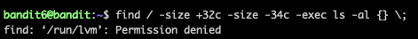

overthewire의 bandit이라는 워게임은 리눅스의 기본 사용법을 알려주기 위한 강의이다. 
과제로 받고 11라운드까지 뚫어놓고 잊고 있었는데 이게 과제로 나와서 예전에 해뒀던 것들 스크린샷으로 복기하는거라 틀린게 있을수도 있다.

접속은 ssh로 한다. id와 passwd는 Level 0에 적혀있다. ssh 쓸줄 모르면 구글에게 물어보도록 하자.

일단 처음 접속하면 이러한 화면이 뜬다.
리빙포인트) 계정은 레벨로 들어가야 있다. 

Lv0 -> Lv1) cat으로 readme를 들여다 보자. 

Lv1 -> Lv2) find 명령어를 이용해 -라는 파일명을 가진 파일을 찾아보자.

Lv2 -> Lv3) /home으로 이동해 spaces in this filename이라는 파일을 찾아보자

Lv3 -> Lv4) ls -al로 안보였는데 inhere 디렉토리로 들어가지길래 들어가보니 파일이 하나 있었고 비밀번호 잘 계신다. 근데 ls에서 -al 옵션 쓰면 원래 숨겨진 디렉토리까지 보여야 하는거 아닌가?

Lv4 -> Lv5) inhere 폴더에 들어가서 파일 다 뒤져보니까 나왔다. 근데 이렇게 뚫는게 맞는건질 모르겠다. 원래 사람이 읽을 수 있는 글씨 찾는 명령어가 있긴 할거다.

Lv5 -> Lv6) inhere 디렉토리 안에 1033byte의 용량이라는 조건이 주어졌다. 우선 inhere 디렉토리 안에서 사이즈 조건으로 1032 ~ 1035 bite인 파일을 찾았다. 이 용량을 가진 파일은 하나밖에 없어 문제 해결

Lv6 -> Lv7) find 명령어를 통해 33바이트라는 조건을 만족시키는 파일을 선별했고, -exec 옵션을 통해 ls -al을 같이 실행시켜 파일을 소유한 user와 group을 확인할 수 있다. 

Lv7 -> Lv8) grep 명령어를 이용해 data.txt에서 millionth 라는 이름을 찾아보자.
리빙포인트) data.txt 실행하지마라. 터미널 터진다

Lv8 -> Lv9) 파일의 다른 텍스트는 여러번 작성되었지만, 여러번 작성된 파일이 하나 있다. 우선 파일을 정리하고, uniq 명령어의 -c의 옵션을 이용해 발생된 빈도로 정리하고, 다시 sort를 이용해 순서대로 정렬하자.

Lv9 -> Lv10) 너 뭐했니? 

Lv10 -> Lv11) base64를 구성하는 텍스트들과 grep 명령어를 이용해 base64로 암호화된 문장을 찾을 수 있다.

Lv11 -> Lv12) 모든 텍스트가 13자리씩 당겨져 있다. 이를 tr 명령어를 이용해 밀어주면 원문이 나온다. 소문자와 대문자가 구별되므로 모두 고려해주어야 한다.