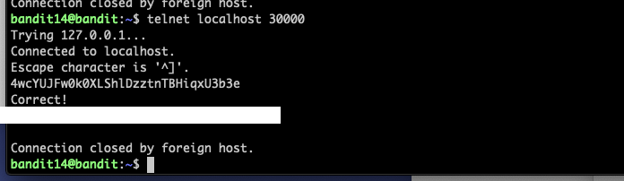

Lv15 -> Lv16) ssh로 bandit15 계정에 접속하려 했지만 연결이 안되어서, telnet으로 접속해 비밀번호를 입력하니 Lv16으로 가는 비밀번호가 나왔다.

Lv16 -> Lv17) openssl로 localhost:30001로 접속하여 비밀번호를 입력하면 해결된다.
추가설명) s_client : ssl/tls를 사용하는 원격 호스트에 접속하기 위한 일반적인 클라이언트를 구현하는 openssl의 옵션

Lv17 -> Lv18) 