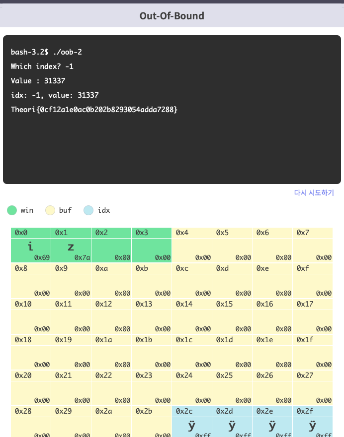

지난 문서에서 간단하게 언급하고 넘어갔던 Memory Corruption 취약점들에 대해 좀 더 이야기를 해보자.

우선 가장 유명하고 오래된 취약점 중 하나인 버퍼 오버플로우다. 얼마나 유명한지 스택 오버플로우라는 이름의 외국 개발자 포럼도 있다.
C언어에서 버퍼는 “지정된 크기의 메모리 공간”이라는 의미이다. 버퍼 오버플로우는 버퍼가 허용할 수 있는 양의 데이터보다 더 많은 값이 저장되어 버퍼가 “넘치는” 취약점이다.
버퍼 오버플로우는 인접한 메모리를 오염시키기 떄문에 어떤 메모리를 오염시킬 수 있는지에 따라 공격 방법이 달라지고, 따라서 오염이 발생하는 위치에 따라 스택 버퍼 오버플로우, 힙 오버플로우 등으로 나눠 부른다.

스택 오버플로우는 가장 초기에 연구되었던 형태의 버퍼 오버플로우이고, 지역 변수가 할당되는 “스택 메모리”에서 오버플로우가 발생한 경우이다.
8바이트의 버퍼 A와 8바이트 데이터 버퍼 B가 메모리에 선천적으로 할당되었다고 생각해보자. 여기서 버퍼 A에 16바이트에 데이터를 복사하게 되면 데이터의 뒷부분이 버퍼A를 넘어 버퍼 B를 침범해 작성된다.
이때 우리는 버퍼 오버플로우가 발생했다고 하고, 이는 프로그램의 Undefined Behavior, 정의되지 않은 동작을 일으키게 되고 이는 어떠한 현상이 발생하는지 예측할 수 없게 한다. 만약 데이터 영역 B에 나중에 호출될 함수 포인터가 저장되어 있었다면 버퍼 오버플로우가 발생했을때 Segmentation Fault, 접근 권한이 없는 메모리를 사용하고자 할 때 발생하는 예외가 발생하게 된다. 공격자는 이를 악용해 함수 포인터를 공격자의 코드와 주소로 덮어 코드를 실행할 수 있다.

첫번째 예시를 살펴보자.
Gets 함수는 사용자로부터 데이터를 입력 받는 함수인데, 사용자가 입력한 데이터를 첫번째 인자로 전달된 버퍼에 저장한다. 이때 별도의 길이 제한이 없고 버퍼 길이에 대한 검증을 하지 않기 때문에 버퍼 크기보다 큰 데이터를 입력한다면 스택 버퍼 오버플로우가 발생한다.
이처럼 버퍼 오버플로우 취약점은 버퍼의 길이에 대한 가정을 올바르게 하지 않아 발생한다. 길이 제한이 없는 API 함수를 사용하거나 버퍼의 크기보다 입력받는 데이터가 더 크게 될떄 사용된다.

두번째 예시로 넘어가자. 두번째 예시의 main 함수는 argv[1]을 check 함수로 쩐달하고, 그 리턴값을 받아온다. 이때, 리턴값이 1이라면 정상적으로 작동하고, 0이라면 접근이 제한된다고 할 수 있다.
핵심이 되는 check 함수에서 16바이트 크기의 버퍼는 인자로 받은 패스워드를 복사하고,  비밀번호를 확인하고 문자열이 같다면 1을 리턴한다.
이때, 패스를 복사하는 과정에서 버퍼의 크기인 16바이트가 아닌 패스워드의 길이만큼 데이터를 복사하게 되고, 16바이트보다 더 큰 데이터를 입력받았을 때 스택 버퍼 오버플로우가 발생하게 된다.
메인에서 인증 결과를 전달하기 위한 auth 변수가 버퍼 뒤에 존재하므로 오버플로우를 통해 공격자가 auth 변수를 참으로 임의로 조작할 수 있게 되고, 이를 통해 실제 인증 여부와 상관없이 인증이 승인되게 된다.

세번째 예시는 버퍼에 24바이트 크기를 할당한다. scanf를 통해 문자열 크기를 입력받고, 문자열 크기만큼 데이터를 입력받는다. 이때 버퍼보다 큰 사이즈를 입력받을 수 있게 되고, 버퍼 오버플로우가 발생한다.

네번째 예시는 버퍼에 32바이트 크기를 부여하고 초기화한 후, 31바이트의 데이터를 입력받는다. sprintf함수를 통해 출력할 문자열을 저장한 뒤 출력하게된다. 
이때 입력받는 데이터가 32바이트를 넘진 않지만, sprintf 함수에서 문자열이 추가되며, 이를 포함했을 때 32바이트를 넘을 수 있게 되고, 버퍼를 가득 채웠을 때 스택 버퍼 오버플로우가 발생하게 된다.

이러한 예시들은 모두 프로그램을 설계하는 과정에서 입력받는 데이터에 길이에 대한 “검증”이 정확하지 못해 발생하게 된다. 만약 공격 벡터로부터 데이터를 입력받고 버퍼에 저장하게 된다면, 이를 유심히 살펴보아야 한다. 데이터를 버퍼에 입력받을 때 버퍼의 범위를 초과하지 않는지 항상 정확히 검사해야 한다.
입력받을 때 길이 제한이 없는 함수를 사용하면 잠재적인 취약점이 될 수 있다. 입력받은 데이터가 버퍼에 저장되기까지 흐름을 통해 버퍼의 크기를 넘는 양을 저장할 수 있는 가능성을 검토해야하고, 길이 제한이 있다면 명시된 길이가 버퍼의 크기를 넘을 수 있는지 검토해야 한다.

버퍼 오버플로우는 스택뿐 아니라 프로그래머가 동적으로 메모리를 관리하는 힙에서도 발생하고, 메모리 영역의 차이만 있는데, 사용 목적과 스택 영역이 다르기 대문에 다른 방법으로 익스플로잇 해야하므로, 여기서는 간단히 넘어간다. 

첫번째 예시는 40바이트 크기의 힙 버퍼 2개를 할당하고, 두번쩨 버퍼에는 Hi 문자열을 복사하고 첫번째 버퍼에 입력을 받는 것이다. 이때 입력 받는 데이터 길이가 버퍼의 크기보다 크게 되어 힙 오버플로우가 발생하게 된다. 첫번째 버퍼 영역에서 버퍼 오버플로우가 발생해 두번째 버퍼 영역에 침범할 경우, 복제된 “Hi” 문자열이 아닌 오염된 문자열이 출력되게 된다.

버퍼 오버플로우는 이정도이다. 이제 OOB 취약점으로 넘어가자. OOB, Out Of Boundary는 버퍼의 길이 범위를 벗어나는 인덱스에 접근할 때 발생하는 취약점이다. 
첫번째 예시에서는 int형 배열을 선언하고, 인덱스값을 입력받는다. 그 다음 입력받은 인덱스값의 배열에 정수를 입력하고 인덱스와 버퍼에 입력받은 입력값을 출력한다.
배열의 길이는 10이므로 인덱스는 0 이상 10 미만이어야 하지만, 인덱스를 입력받을 때 이를 검증하지 않고, c는 인덱스를 이용할 때 별도의 경계 검사가 존재하지 않기 때문에 인덱스 입력에 올바르지 않은 값을 사용해 배열 밖의 데이터값에 접근할 수 있다.

oob의 발생 여부를 판단할 때는 버퍼의 인덱스로 사용할 수 있는 값과 버퍼의 인덱스로 입력될 수 있는 모든 값의 범위를 비교하면 된다. 인덱스로 사용할 수 있는 값의 범위의 부분집합이 입력될 수 있는 모든 값이 된다면 안전하다고 할 수 있을 것이다.

두번째 예시는 인덱스 값으로 입력받은 값을 10으로 나눈 나머지를 사용하는데 양수만 고려했을때는 안전해 보이지만, 음수에 대한 검증을 하지 않는다. 따라서 나머지가 음수가 되게 한다면 Oob가 발생할 수 있다.

세번째 예시는 입력받은 인덱스를 양수로 바꿔줄 수 있는 코드까지 추가되었고, 아무 문제가 없어보인다. 하지만 이때는 int가 받을 수 있는 수의 범위에서 문제가 생긴다. int는 양수 2^31-1까지 표현 가능한데, 이때 2^31은 음에서만 표현 가능한다. 따라서 2^31을 인덱스에 입력하면, 절대값을 구하는 연산을 수행한 후에도 그대로 2^31이 저장되고, 이에 따라 음수가 저장되며 OOB가 발생하게 된다.
근본적인 해결책은 부호 정보 없이 양수만 저장하는 unsigned int형으로 선언하거나, 인덱스 입력 후 경계 검사 구문을 추가해야 한다.

Off-by-one 취약점으로 넘어가자. 경계 검사에서 하나의 오차가 있을때 발생하게 된다. 이는 버퍼 경계 계산 혹은 반복문의 횟수 계산시 포함 관계를 잘못 생각하거나, 0부터 시작하는 인덱스를 고려하지 않아 발생한다. 
주어진 예시의 경우 배열에 16바이트 문자열을 입력받은 후 복사하는 함수를 통해 배열과 배열의 크기를 넘겨주었는데, 반복 구간을 [0, sz)가 아닌 [0,sz]로 설정해 총 sz+1회의 복제가 이루어지게 된다. 따라서 off-by-one 취약점이 발생하게 된다.

버퍼 오버플로우 중 스택 버퍼 오버플로우는 지역 변수가 할당되는 스택 메모리에서 발생하고, 데이터를 입력받거나 복사하는 과정에서 검증이 없을때 발생한다.

힙 버퍼 오버플로우는 동적으로 할당된 힙 메모리 영역에서 발생한다. 데이터를 입력받거나 복사할 때 길이 검증이 완벽하지 않으면 발생한다.

OOB는 버퍼 길이 범위를 벗어나는 인덱스에 접근할 때 발생한다. 올바르지 않은 값이 인덱스로 사용될 수 있을 때 발생한다.

Off-By-One은 버퍼의 경계를 잘못 계산하거나 잘못된 반복문의 연산자를 사용하여 발생하게 된다.

포맷 스트링 버그(format string bug)는 printf, sprintf와 같이 포맷 스트링을 사용하는 함수에서 발생하는 취약점이다. 프로그래머가 지정한 물자열이 아닌 사용자의 입력이 포맷 스트링으로 전달될 때 발생한다. 사용자의 입력을 받아 printf등으로 바로 출력하려고 할 때, 검증되지 않은 사용자의 입력이 포맷 스트링으로 취급되어 프로그래머가 의도치 않은 동작을 수행하도록 하는 버그이다.

첫번째 예시는 일반적인 문자열을 입력할 땐 정상적인 문자열이 출력되지만, %x, %d와 같은 포맷 스트링을 문자열로 입력한다면 printf(“%x, %d”); 처럼 출력되고. 인자가 전달되지 않기 때문에 쓰레기값을 인자로 취급해 출력한다.

두번째 예시는 fprintf 함수에서 발생하는 포맷 스트링 버그이다. fprintf 함수의 두번째 인자는 포맷 스트링이어야 한다. 그러나 이 예시에서는 포멧 스트링이 위치해야 할 곳에 사용자의 버퍼가 존재해 포맷 스트링 버그가 발생한다. 위의 경우와 마찬가지로 포맷스트링을 입력하면 의도치 않은 값이 파일에 저장된다.

포맷 스트링 버그는 포맷 스트링을 사용하는 함수의 인자만 검토하면 되기 때문에 다른 취약점에 비해 막기 쉽다. 그러나 포맷 스트링 버그는 프로그램에 큰 영향을 줄 수 있는 취약점이기 떄문에 항상 염두에 두어야 한다. Printf / sprintf / fprintf 등 printf계열 함수들이 보통 포맷스트링을 사용한다. 이러한 포맷 스트링을 인자로 받는 함수들을 사용할 떄 검증되지 않은 입력이 포맷 스트링으로 전달되지 않도록 주의해야 한다.

실습을 조져보자. 물론 항상 조져지는건 내 대가리였다. 지금도 3시간째 씨름중이다. 아 오늘내로 다 끝내야 다른 과제도 하는데… 여튼 잡설은 그만하고 넘어가도록 하자.

더미 데이터를 이용해 들여다보는 메모리의 위치를 생각하자. 5번째 %08x에서 테스트용 데이터가 확인되는 모습이다.  따라서 13번째 공간? 스택?에 접근한다면, auth에 접근할 수 있게 될것이다.  

내가 생각했던 구조가 맞을것같다. 확신을 가지고 살자.

확실하다. 13번째에 0x41414141이 저장되어 있다
이제 이 공간을 변조해야 한다. 

4시간동안 들여다봤는데 답이 안나옵니다…. ㅠㅠ우선 다음장으로 넘어가자

Double Free와 Use-After-Free에 대해 알아보자. C언어는 수동으로 동적 메모리를 관리해야하는 언어디아. 메모리를 정확히 관리하지 못하면, 메모리를 정확히 관리하지 않아 메모리를 할당하고 해제하지 않거나, 해제된 메모리에 접근해 메모리 릭이 발생한 경우 큰 문제로 이어질 수 있다.
동적 메모리 관리에서 가장 자주 발생하는 문제는 해제된 메모리를 정확히 관리하지 않아 발생한다. Double free 취약점은 이미 해제된 메모리를 다시 해제해 발생하게 된다. UAF 취약점은 해제된 메모리에 접근해 값을 쓸 수 있는 취약점이다.
첫 예시는 메모리를 할당하고, 할당한 메모리에 hello world! 문자열을 복사한 뒤 이를 출력한다. 그러나 메모리 포인터 a 해제가 18열에서 한번, 21열에서 한번 이루어진다. 이 예시 코드는 우분투 18.04에서 정상 종료되고, 따라서 어떠한 일이 발생하는지는 모르지만 해제된 메모리를 다시 해제하는것이 불가능하지 않다는 사실을 알 수 있다. 
a메모리를 할당했을때 a는 특정 힙 메모리의 주소를 저장하고 있다. 그러므로 a를 free했을때, 시스템에 해당하는 힙 메모리 할당자의 구현에 따라 메모리가 해제된다.  이때 같은 메모리를 두번 해제하는 등 비정상적인 일이 발생하면 공격자가 프로그램을 예상치 못한 실행 흐름으로 만들 수 있다.

uaf로 넘어가보자. 첫번째 예시는 100바이트 크기의 메모리 a를 할당하고, Hello World를 복사한다. 힙 메모리에 Hello World가 저장되어있는 상태이다.
그 다음 a를 해제하고 새로운 100바이트 메모리에 메모리 b를 할당한다.  새로 할당된 메모리에는 Hello Pwnable!이라는 문자열을 복사한다. 힙 메모리에 Hello Pwnable이 들어가있는 상태이다. 이때, 포인터 a의 저장된 메모리 주소값은 바뀌지 않았고, 메모리 a와 b가 같은 주소를 가리키고 있다. 이는 이미 해제되었던 메모리 a가 메모리 할당자로 들어가고, 새로운 메모리 영역을 할당할 때 , 메모리를 효율적으로 관리하기 위해 기존에 해제되었던 메모리가 그대로 반환되어 일어나는 일이다.
그래서 이미 해제된 메모리 a에 접근하면 메모리 b가 같이 영향을 받게 되고, 프로그래머가 의도치 않은 일이 발생할 수 있다. 예를 들면, 이미 해제된 포인터 a와 새로 할당한 포인터 b가 같은 모니터 영역을 가리키고 있기 때문에, 포인터 a에 Hello World! 문자열을 복사하고 b의 내용을 출력하면 “Hello World’가 출력되게 된다.

메모리 할당자는 환경에 따라 다르지만, 일반적으로 효율성을 위해 이미 해제된 메모리를 재사용한다. 이 때 해제된 메모리 포인터에 데이터를 쓴다면, 이미 다른 곳에 사용되고 있는 메모리에 데이터가 작성될 수 있다. 이와 같이 이미 해제된 메모리를 다시 사용해 의도치 않은 동작을 발생시키는 것을 Use-After-Free 취약점이라고 한다
프로그램 규모가 커지고, 복잡성이 커지면 생각지도 못한 곳에서 uaf 취약점이 발생하게 된다. 특히 여러 컴포넌트를 결합한 프로그램에서 두드러지는데, 예를 들어 두 컴포넌트가 서로 상호작용하며 프로그램이 동작하면, 한 컴포넌트에서 객체나 메모리 사용이 끝났다고 판단에 해재했지만 다른 컴포넌트에서 이 내용이 동기화되지 않아 그 포인터를 사용할 수 있다.
이런 취약점은 힙 메모리 할당자는 각자 동작이 다르기 때문에 취약점의 영향력을 판단하기 어렵다. 따라서 공격이 불가능하다고 알려진 버그가 실제로 공격 가능한 경우들이 있다. 힙에서 발생하는 여러 취약점을 공격하기 위해서는 메모리 할당자의 구현을 정확히 알아야 한다.

C와 C++에서는 수많은 구조체와 클래스를 선언하고 인스턴스를 만들어낸다. 변수를 선언하거나 인스턴스를 생성할 떄, 의도된 경우가 아니라면 반드시 초기화해야 한다. 메모리가 초기화되지 않는다면 덤프값이 들어가게 되고, 프로그램의 흐름이 붕괴될 수 있다.
공격자가 메모리를 정교하게 조작해 초기화되지 않은 영역에 입력이 들어가면, 초기화하지 않은 메모리를 초기화 했다고 가정하는 코드에선 보안 취약점으로 이어질 수 있다.

예시를 살펴보자. 구조체 person은 문자형 포인터와 정수형 변수를 멤버변수로 갖는다. main에서 person을 선언하고, 문자형 포인터의 길이를 입력받는다.  길이가 100 이하면 malloc 함수를 통해 메모리를 할당하고 포인터를 통해 정해진 길이만큼 입력을 받는다. 이 예시에선 두가지 문제가 존재한다. 
첫번째 문제는, 문자형 포인터에 할당된 메모리를 초기화하지 않는다. read함수는 입력받을떄 별도의 구분자를 붙이지 않아, 이후 name을 출력하는 부분에서 초기화되지 않은 다른 메모리가 출력될 수 있다.
두번째는, 문자 배열? 길이가 100 이상일 떄 이에 대한 예외처리가 이루어지지 않는다는 것이다. 100 이상일 경우 주어진 포인터에 할당된 값은 쓰레기값이 된다. 공격자가 이 값을 조작한다면, read 함수를 통해 데이터를 입력받을 때 원하는 메모리 주소에 원하는 값을 쓸 수 있게 된다.

정수의 형변환과 관련되어 생기는 문제도 있다. 정수의 형변환을 제대로 고려하지 못해서도 취약점이 발생할 수 있다. 정수의 범위에 대한 정확한 이해가 없다면 치명적인 취약점을  발생시킬 수도 있다. C의 정수 자료형이 표현할 수 있는 범위를 알아야 한다. 32, 64비트 등 아키텍쳐에 다라 표현할 수 있는 수의 범위가 달라지는 경우도 존재한다.

연산사 연산의 피연산자로 오는 데이터들의 자료형이 다르고, 직접 자료형을 명시하지 않으면 묵시적인 형 변환이 발생한다. 이러한 형 변환에 대해 숙지하지 않으면 취약점으로 이어질 수 있다. 묵시적 형 변환의 규칙을 알아보자.

대입 연산 - 대입 연산자의 좌변과 우변의 자료형이 다르면 묵시정 형 변환이 발생한다. 작은 정수 자료형에 큰 정수를 저장하면, 작은 정수에 맞춰 상위 바이트가 소멸된다.
정수 승격 - char(문자형, 1바이트)이나 short(2바이트, 정수 자료형)의 연산에서 int로 연산하게 되면서 발생한다. 각각의 범위에 맞는 경우 다시 char나 short로 변환되어 저장된다.
피연산자 불일치 - 피연산자가 불일치하는 경우 작은 바이트에서 큰 바이트로, 정수에서 실수로 형 변환이 일어나게 된다. 예를 들어 int(정수)와 double(실수)을 더하면 int가 double형으로 변환되어 연산이 진행된다.

Int에서 발생하는 문제를 예시로 살펴보자. 예시는 길이를 사용자에게 입력받고 len + 1이 길이를 문자형 포인터에게 할당하고 포인터를 buf에 저장한다.  이때 길이에 -1을 대입하면, 0바이트의 메모리가 할당되고, 리눅스에서는 Malloc의 인자가 0이라면 정상적인 힙 메모리가 반환된다. 이후 read 함수의 텍스트 길이 인자로 -1이 호출 되는데, 인자로 전달된 값은 Int지만 인자로 받는 값은 size_t형으로 받으므로 묵시적 형 변환이 일어난다. 이는 32비트 아키텍쳐 기준으로 2^32 -1을 호출하게 된다. 따라서  지정된 크기의 버퍼를 넘는 데이터를 넣게 되고, 힙 오버플로우가 발생한다.

2번째 예시도 살펴보자. 주어진 함수는 두개의 인수와 초기화 데이터인 포인터를 인자로 받고, 테이블을 초기화한다. 두 인수를 곱한 값을 저장하는데, 이때 unsigned 타입으로 받게 되어, 2^32를 넘어가면 의도치 않은 값이 들어가게 된다. 예를 들어 첫번째 인자가 2^16, 두번째 인자가 2^16+1 이면 두 인자의 곱이 2^32 + 2^16이 되어, 실제로 두 인수의 곱은 2^16으로 저장된다. 이때 2^16개의 메모리가 할당되지만, 2^16+1회 반복되며 memcpy함수가 메모리를 복사하기에 버퍼 오버플로우가 발생한다.

문제를 살펴보자. Max_size는 0x8000, 즉 16^4=2^16의 데이터로 설정된다. signed int에서는 -2^16 ~ 2^16-1 만큼의 데이터를 표현할 수 있기 때문에,  길이에 int의 최댓값인 2^16-1을 넣게 되면, (길이+1)이 -2^16이 되어 2^16보다 작기 때문에 조건문의 검사가 거짓이 된다. 아래 read 함수가 실행될수 있게 되고 이 함수에서 힙 오버플로우가 발생할 수 있게 된다.

정리하자
포맷 스트링 버그는 printf, sprintf 함수와 같이 포맷 스트링을 사용하는 함수들을 안전하게 사용하지 않아, 사용자의 입력이 포맷 스트링으로 전달되어 발생한다.
Double Free는 동적 할당된 하나의 힙 메모리를 두번 해제해 발생한다. 
UAF는 기존에 해제되었던 메모리가 반환되어 생기는 취약점이다. 이미 해제된 메모리를 다시 사용했을 때 발생한다.
변수를 선언하거나 인스턴스를 생성할 떄 초기화를 하지 않으면 할당된 변수가 기존에 있던 덤프 값을 가지게 되며 취약점이 발생할 수 있다.
Integer issue들은 정수의 형변환 처리 과정에서 발생하는 문제이다. 각각의 자료형에 대한 범위를 고려하지 않아 발생하고, 독립 취약점보단 다른 취약점에 연계해 사용한다.

프로그래밍 언어와 컴퓨터에는 얼핏 생각했을 땐 당연하지만, 실제로는 그렇지 않을 수 있는 성질들이 존재한다. 이러한 성질을 모르고 프로그래밍을 한다면 연결고리가 약해져 시스템이 공격 받을수도 있게 된다. 따라서 프로그램을 만들땐 이와 같은 문제들을 정확히 인지하고 어떻게 해야 이러한 연결고리의 약점 없이 안전한 프로그램을 만들 수 있을지 고민해야 하고, 공격자는 이러한 문제를 인지해 취약점을 찾을 수 있어야 한다.

Ref : http://dreamhack.io System Exploitation Fundamental.
저작권 표현을 이런식으로 해도 될질 모르겠다. 피드백하실때 한번만 확인해주세요ㅠ