오버플로우에 조금 더 깊이 들어가보자. 옛날 옛적부터 내려오던 달고나 자료로 공부를 해보자. 이건 나 중학교때도 있던것 같은데 진짜 무슨 팔만대장경인가.

우선 이렇게 오래된 공격 기법인 버퍼 오버플로우를 왜 배우는지 생각해보자. 우선 제일 결정적인 이유는, 아직도 취약한 프로그램들이 만들어지고 있기 때문이다. 오래되었어도 C와 C++은 가장 많이 사용하는 언어 중 하나고, 데이터에 대한 검증이 제대로 이루어지지 않으면 취약점이 발생할 수 있게 된다. 그리고 오버플로우 공격 기법을 다시 짚어보며 원리를 이해하면 근래에 발표되는 문서를 이해하는데 큰 도움이 될 것이다.

버퍼 오버플로우 공격 기법을 이해하기 위해서는 컴퓨터에서 이루어지는 프로세스의 구조, 자료 저장 방식, 함수 호출 과정 / 리턴 과정, 함수 실행 과정에 대한 이해가 필요하다.

8086, 즉 x86 시스템의 기본 메모리 구조부터 알아보자. 기본적으로 낮은 주소에 상주하는 커널과 그 위로 존재화는 사용 가능한 공간이 있다. 시스템이 초기화되면, 시스템은 커널을 메모리에 적재시키고, 가용 메모리 영역을 확인하게 된다. 시스템은 운영에 필요한 기본적인 명령어 집합을 커널에서 찾기 때문에, 커널이 가장 낮은 주소에 상주하게 된다 커널은 기본적으로 64KB 영역에 자리잡지만, 오늘날의 운영 체제는 이를 확장해 더 큰 영역을 사용한다.

32비트 시스템에서는 cpu가 한번에 32바이트의 데이터를 처리할 수 있으므로 메모리 영역에 주소를 할당할 수 있는 범위가 0 ~ 2^32-1 이다. (64비트에서는 2^64-1까지)

이제 하나의 프로그램이 실행되는 메모리 구조를 알아보자. 하나의 프로세스를 실행시키면 이 프로세스는 segment라는 단위로 묶여 가용 메모리 영역에 저장된다. 오늘날의 시스템은 멀티 태스킹이 가능해, 메모리에는 여러 개의 프로세스가 한번에 저장 될 수 있고, 병렬적으로 작업을 수행하게 된다. 따라서 가용 메모리 영역에는 여러개의 segment들이 저장될 수 있다. segment는 하나의 프로세스를 묶은 단위로 실행 시점에 어느 위치에 저장될 지가 결정된다. 시스템에는 최대 16,383개의 segment가 저장될 수 있고 하나의 segment에는 2^32byte의 크기를 가질 수 있다. 

segment는 3개의 구조로 나눠진다. code segment, data segment, stack segment로 나누어지게 된다.
code segment에는 시스템이 인식하는 명령어(instruction)들이 들어 있다. 컴파일러가 만들어 낸 기계어 코드이다.
instruction들이 명령을 수행하면서 분기, 점프, 시스템 호출 등을 수행하는데, 분기와 점프에서 메모리의 특정 위치에 있는 명령을 지정해 주어야 한다.하지만 segment는 메모리 상에 어떤 위치에 저장될 지 컴파일 과정에서 알 수 없기 때문에 정확한 주소를 지정할 수 없다.
따라서 segment에서는 논리적 주소(logical address)를 사용한다. 논리적 주소는 메모리 상의 실제 주소와 연결된다.  즉 segment는 segment selector에 의해 자신의 시작 위치(offset)를 찾을 수 있고, 자신의 시작 위치로부터의 논리적 주소를 통해 명령을 수행할지를 결정하게 되는 것이다. 실제 메모리 주소는 offset + logical addresss라고 할 수 있다. segment가 어느 위치에 있더라도 segment selector가 segment의 offset을 알아내어 해당 instruction의 정확한 위치를 알아낼 수 있다.

Data segment에는 프로그램이 실행시 사용되는 데이터인 전역 변수들이 들어간다. 즉, 프로그램 내에서 전역 변수를 선언하면 그 변수가 data segment에 자리잡게 된다. Data segment는 4개로 나눠지게 되는데, 이는 현재 모듈의 data segment, 상위 레벨로부터 상속받은 데이터 모듈, 동적 생성 데이터, 다른 프로그램과 공유하는 공유 데이터 부분이다.

Stack segment는 현재 수행되고 있는 handler, task, program이 저장하는 데이터 영역이다. 지역 변수가 이 stack segment에 자리잡게 되고, 따라서 우리가 사용하는 버퍼가 이 stack segment에 자리잡게 된다. 또 프로그램이 사용하는 multiple stack을 생성할 수 있고 각 stack들 간 switch가 가능하다.
스택은 처음 생성될 때 필요한 크기만큼 만들어지고, 프로세스의 명령에 의해 데이터를 저장하는 과정을 거치는데, stack pointer라고 하는 레지스터가 스택의 꼭데기를 가리키고 있다. 스택에 데이터를 저장하고 읽는 과정은 push와 pop instruction에 의해 수행된다. 
스택은 후입선출의 과정으로 데이터를 가져온다. 새로운 데이터는 push를 통해 맨 위로 올리고, 맨 위부터 pop을 통해 가져온다.

지금까지 segment의 구조를 알아보았다. 그럼 이제 프로세스를 cpu에 적재시키고, 흩어져있는 명령어 집합과 데이터들을 적절하게 선택하고 읽고 저장하기 위한 저장 공간인 레지스터에 대해 알아보자. 레지스터는 cpu가 RW해야 하는 데이터들이므로 cpu 내부의 메모리를 이용한다

레지스터는 목적에 따라 범용 레지스터(General-Purpose Register), 세그먼트 레지스터(Segment Register), 플래그 레지스터(Program status and control register), 그리고 인스 트럭션 포인터 (instruction pointer)로 구성된다.  

범용 레지스터는 논리 연선, 수리 연산에 사용되는 피연산자, 주소를 계산하는데 사용되는 피연산자, 그리고 메모리 포인터가 저장된다. 그리고 범용 레지스터는 프로그래머가 임의로 조작할 수 있게 허용되어 있다. 4개의 32bit 변수라고 생각하면 된다. 16비트 시절 각 레지스터를 AX, BX, 등으로 불렀지만 32비트로 전환되면서 Extended가 이름에 붙어 EAX등으로 부른다. 각 레지스터는 필요에 따라 아무렇게나 사용해도 되지만, 이름을 보고 목적에 따라 사용하는 것이 좋다. 컴파일러도 이런 목적에 맞춰 사용한다.

세그먼트 레지스터는 code segment, data segment, stack segment를 가리키는 주소가 들어있다. 정확히, 프로세스의 특정 세그먼트를 가리키는 포인터 역할을 한다. CS 레지스터는 code segment를 DS, ES, FS, GS 레지스터는 data segment를, SS 레지스터는 stack segment를 가리킨다. 이렇게 세그먼트 레지스터가 가리키는 위치를 바탕으로 우리가 원하는 segment 내의 특정 데이터, 명령어들을 정확히 읽을 수 있게 된다.

플래그 레지스터는 프로그램의 현재 상태나 조건 등을 검사하는데 사용되는 플래그들이 있는 레지스터이다. 컨트롤 플래그 레지스터는 상태 플래그, 컨트롤 플래그, 시스템 플래그들의 집합이다. 시스템이 리셋되면 이 레지스터는 0x00000002의 값을 가진다. 1, 3, 5, 16, 22~31번 비트는 예약되어 있어 소프트웨어에 의해 조작할 수 없다.
플래그의 종류별로 나눠진 플래그는 한번 읽어보자. 큰 이해는 힘들수도 있다.

인스트럭션 포인터는 다음 수행해야 하는 명령이 있는 메모리 상의 주소, 즉 현재 code segment의 offset값이 들어가 있어, 하나의 명령어 범위에서 선형 명령 집합의 다음 위치리를 가리킬 수 있다. 뿐만 아니라 여러가지 instruction이 있는 주소값을 가진다. EIP 레지스터는 소프트웨어가 바로 엑세스 할 수 없고, control-transfer instruction 이나 interrupt와 exception에 의해 제어된다. EIP 레지스터를 읽으려면 CALL instruction을 수행하고 Procedure Stack 으로부터 리턴하는 instruction의 address를 읽는 것이다. Procedure stack의 return instruction pointer의 값을 수정하고 return instruction(RET, IRET)을 수행해 EIP 레지스터의 값을 간접적으로 지정할 수 있다.
설명이 좀 그래서 따로 찾아본 내용도 적어둔다. EIP는 Extended Instruction Pointer니까, 아마 x86에서 쓰는 Instruction Pointer를 지칭할것이다.

레지스터의 구조를 알아야 하는 이유는, 버퍼 오버플로우 공격을 할 떄 적절한 padding의 사용과 return address의 정확한 위치를 찾고 assembly 코드를 추출하고 이해하는데 필요하다. 레지스터의 명령어 하나하나까지 머릿속에 저장하고 다니는건 정신병을 유발할 수 있으니, 그냥 머리속에 프레임만 넣어두고 필요한 것들은 이 문서를 참조하거나 검색을 통해 찾도록 하자.

이제 프로그램이 구동될때 Segment에서 어떤 일이 일어나는지 알아보자. 프로그램이 실행되면 프로세스가 메모리에 적재된다. 이들이 작동하는 원리를 알기 위해 간단한 프로그램을 예시로 들었고, 이를 어셈블리 코드로 변환해 컴파일 하는 과정이 나와있다. 어셈블리 코드는 컴파일러 버전 별로, 아키텍쳐 별로 달라지게 된다. 그러니까 다르더라도 너무 신경쓰지 말자. 좋고 나쁘고 자시고 한건 없다. 일단 다르면 짜증나니까 문서 기본세팅 보고 따라간다.

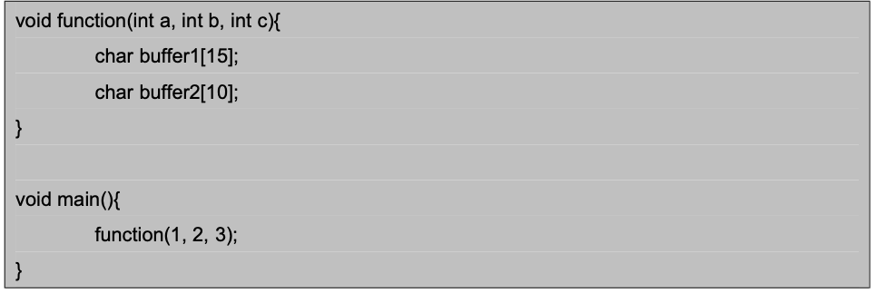

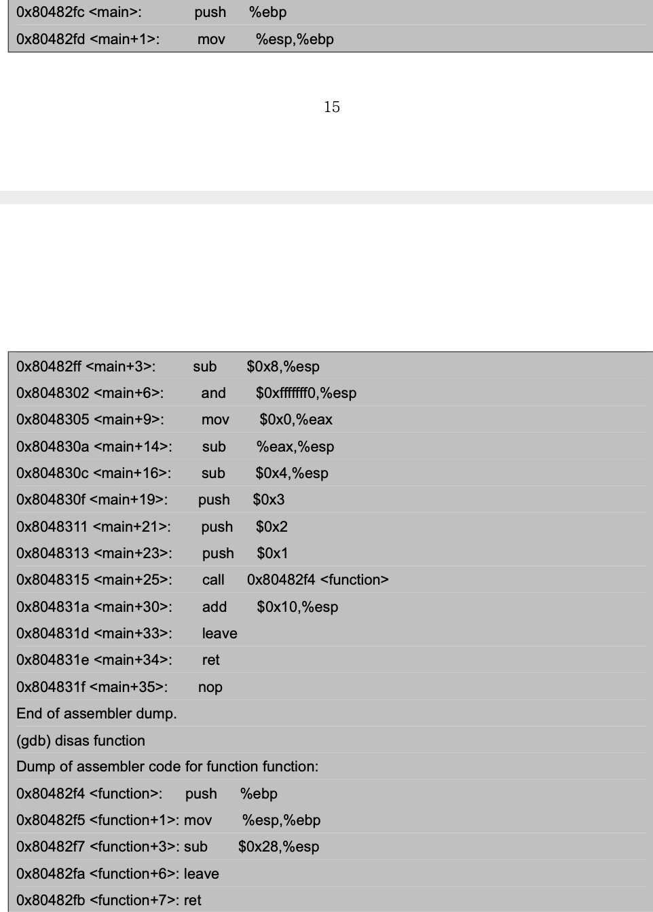

우선 예시 프로그램이 컴파일 되어 실제 메모리 상에 어느 위치에 존재하게 될지 알아보기 위해 컴파일 후 gdb를 통해 어셉블리 코드와 logical address를 살펴보자. 주어진 결과에서, 앞에 나오는 Hex 값이 logical address이다. 이 주소를 살펴보면 function 함수가main 함수보다 먼저 메모리에 자리하고 있는 것을 볼 수 있다.

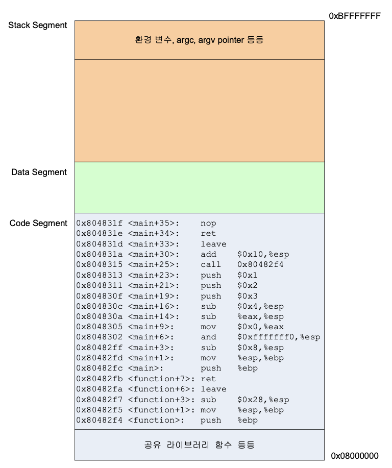

그림과 같이 segment가 구성되었다. 프로그램마다 segment 크기 다르기때문에 최상위 메모리 주소 그림과 다를 수 있고, 사진속은 임의의 메모리 값이다. segment의 logical address는 0x08000000부터 시작하지만 컴파일과 링크 되는 과정에서 다른 라이브러리들이 들어오고, 따라서 직접 코딩한 시작점과 offset은 동일하지 않을 것이다.
비슷하게, Stack segment는 0xBFFFFFFF까지 할당되지만 필요한 환경변수나 실행 옵션으로 주어진 변수들에 의해 가용 영역은 그보다 아래 존재한다. 주어진 코드에 global var이 지정되지 않아 data segment에는 링크된 라이브러리 전역변수 값만 존재한다.

프로그램이 시작되면, eip 레지스터는 main() 함수가 시작되는 코드를 가리키고 있을 것이다. main()함수의 시작점은 0x80482fc가 된다. 따라가 보도록 하자.

*ESP가 어느 지점을 가리키는지 알아보기 위해 gdb를 통해 레지스터 값을 알아보았다.
(*ESP : SS 레지스터가 가리키는 stack segment의 맨 꼭대기를 가리키는 포인터.)
(*SS 레지스터 : 세그먼트 레지스터중 Stack Segment 주소 저장되있는거)

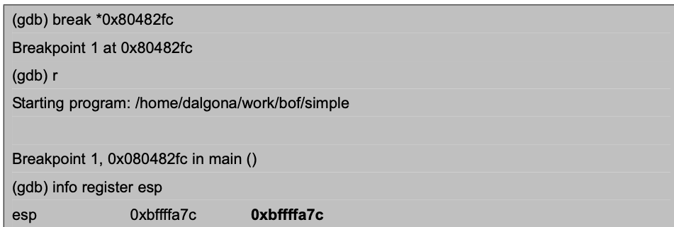

1단계.
좌측의 그림과 같이 EIP는 main 함수의 시작점을 가리키고 있다. ESP가 스택의 맨 위를 가리키는 이유는 프로그램이 수행되면서 수많은 push / pop 명령을 할것이기 때문에 어떤 지점에 있는 데이터를 push/pop을 할것인지 가리키는 의미이다. EBP를 저장하는 이유는 이전에 수행했던 함수의 데이터를 보존하기 위해서이다. 그래서 Base Pointer라고도 부른다. 그래서 함수가 시작될 때 stack pointer(ESP)와 base pointer(EBP)를 새로 지정하는데, 이러한 과정을 함수 프롤로그 과정이라고 한다. 

(TMI) 시스템 아키텍처에 따라 push 명령이 실행될 때 ESP가 가리키는 지점에 데이터를 넣을건지 그 아래 지점에 넣을건지 달라진다. 마찬가지로 pop 명령이 실행될 때 ESP 지점의 데이터 혹은 ESP 지점 위의 데이터를 가져갈지도 다르게 동작한다. 상관 없고 작동할때 확인한다.
(*EBP - SS 레지스터가 가리키는 스택상의 한 데이터를 가리키는 포인터)

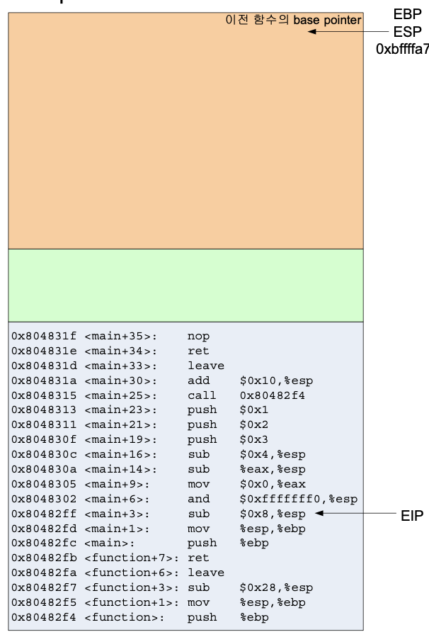

2단계.

우선 Push %ebp를 수행해 이전 함수의 base pointer를 EBP에 저장한다. stack pointer(ESP)는 0xbffffa8c에서 한칸 내려가 4byte 아래인 0xbffffa78를 가리키게 할 것이다.

mov %edp, %ebp를 수행해 ESP값을 EBP에 복제한다. 이제 함수의 base pointer에 이전 stack pointer의 주소값을 저장하고, 지금은 두 포인터가 같은 지점을 가리키게 된다.

sub $0x8, %esp는 ESP에서 8을 빼는 명령이다. 이를 통해 esp는 8바이트 아래 지점을 가리키게 되고 스택에 8바이트 공간이 생기게 된다. 이렇게 공간이 생기는 것을 스택이 8바이트 확장된다고 한다. 이 명령이 수행되면 ESP에는 0xbffffa70이 들어가게 된다.

And $0xfffffff0, %esp는 ESP와 11111111 11111111 11111111 11110000과 AND 연산을 한다. 이는 ESP 주소값 맨뒤 4비트를 0으로 만들려고 하는 별 의미없는 명령이다.

mov $0x0, %eax는 EAX 레지스터에 0을 넣는 명령

sub %eax, %esp는 ESP에 들어 있는 값에서 EAX에 들어 있는 값만큼 뺀다. 이 역시 stack pointer를 EAX만큼 확장하려는건데, 지금 EAX에 0이 들어있어 의미 없다

sub $0x4, %esp는 스택을 4바이트 확장하는 명령이다. 따라서 ESP에는 0xbffffa6c가 된다.

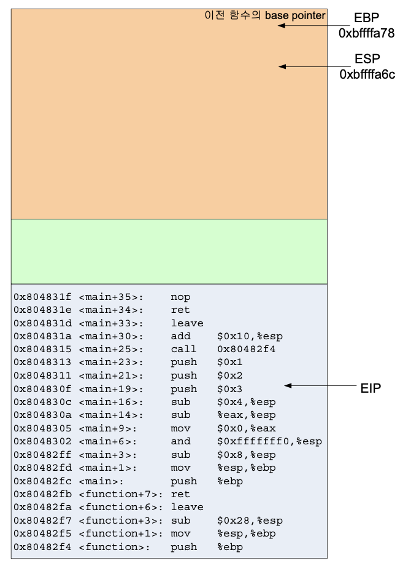

3단계.

지금까지 명령을 수행한 모습은 윗 그림과 같고, ESP는 12바이트 이동해 스택은 12바이트 확장되었다.

다음으로 수행할 명령은 push $0x03, push $0x02, push $0x01 이다. 이것은 function(1, 2, 3)을 수행하기 위한 인자값을 차례대로 넣어주는 명령이다. 순서가 3, 2, 1로 되어 있는것은 스택에서 꺼낼 때 거꾸로 나오기때문에 그렇다, function()의 프롤로그가 끝난 다음의 스택의 모습을 보면 왜 이 값들이 여기서 들어가는지 이해할 수 있을 것이라는데, 솔직히 막 와닿지는 않는다.

call 0x80482f4 명령은 0x80482f4에 있는 명령을 수행하라는 것이다. 0x80482f4에는 function 함수가 자리잡고 있다.

call 명령은 함수를 호출할 때 사용하는 명령이고, 함수 실행이 끝난 다음 다시 이후 명령을 계속 수행할 수 있도록 이후 명령이 있는 주소를 스택에 넣은 뒤 EIP에 함수의 시작지점의 주소를 넣는다. 이 경우  add $0x10, %esp 명령이 있는 주소이다.
이를 통해 함수 수행이 끝나고 나면 어디에 있는 명령을 수행해야 하는지를 스택에서 pop해 알 수 있는것이다. 이것이 바로 return address이고, 이는 버퍼 오버플로우에서 중요하다. 왜 중요한지는 나중 가면 나오겠죠?
EIP에는 function 함수가 있는 0x80482f4가 들어간다.
(EIP : 인스트럭션 포인터)

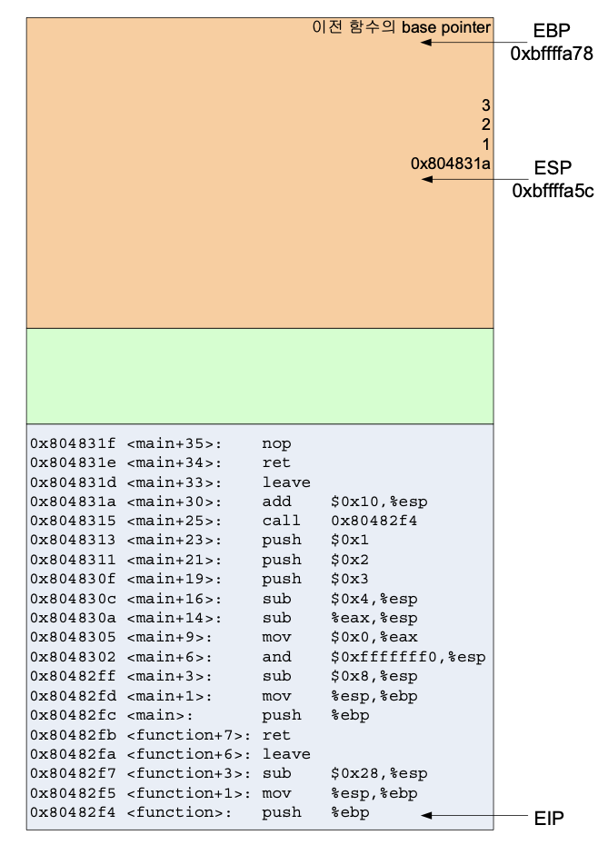

4단계
이제 EIP는 function() 이 시작되는 지점을 가리키고, 스택에는 main() 함수에서 넣었던 값들이 쌓여있다.
function() 함수에서도 마찬가지로 함수 프롤로그가 수행된다. 따라서 push %ebp, mov %esp, %ebp 명령이 수행된다. 이때 main 함수에서 사용하던 base pointer가 저장되고 stack pointer를 function 함수의 base pointer 삼는다.

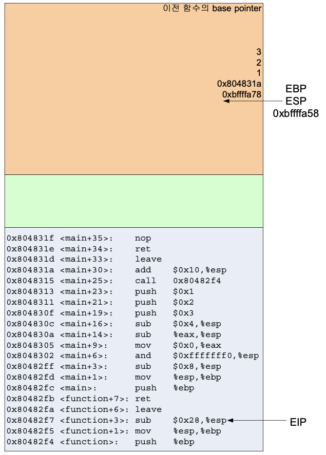

5단계
function 함수의 프롤로그가 끝나고 만난 명령은 sub $0x28, %esp 이다. 이것은 스택을 40바이트 확장한다
40바이트가 된 이유는 예시 코드의 function 함수에서 지역변수로 buffer1과 buffer2를 선언했기 때문인데, buffer1[15]는 총 15바이트가 필요하지만 스텍은 word(4바이트) 단위로 증가하기 때문에 16바이트를 할당하고, buffer2[10]을 위해 12바이트를 할당한다.  따라서 확장되어야 할 스택의 크기는 28바이트가 된다. 근데 또 gcc 버전에 따라 달라진다. 버전마다 다르다는데 여튼 gcc 16버전 이후로 스택이 16배수로 할당된단다. 그래서 buffer1 buffer2	에 16바이트 할당되고 더미 8바이트 들어가 40바이트 된다. 더미는 그냥 쓰레기값이다.

Function 함수의 인자는 function 함수의 base pointer와 return address 위에 존재하게 된다. 이것은 main 함수가 호출될 때 주어지는 argc, argv이 위치한 곳과 같은 배치가 된다.

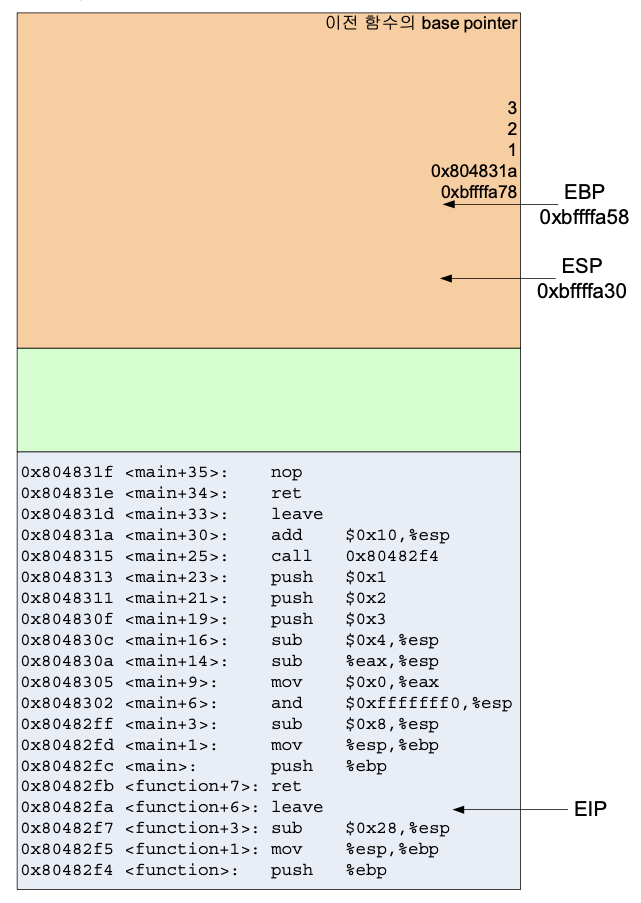
6단계
이렇게 버퍼가 만들어지면 우리가 필요한 데이터를 쓸 수 있게 된다. 보통 mov $0x41, [$esp -4]  / mov $0x42, [$esp-8] 과 같은 형식으로 esp를 기준으로 스택의 슥정 지점에 데이터를 복사해 넣는 방식으로 동작한다, 주어진 코드엔 데이터를 입력하는 과정이 없으니 스택이 만들어진 것만 확인하자.

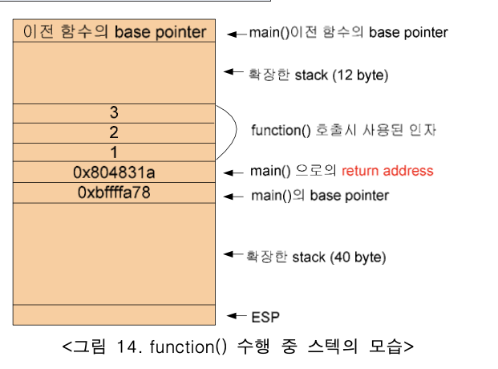

만들어진 스택을 살펴보자.

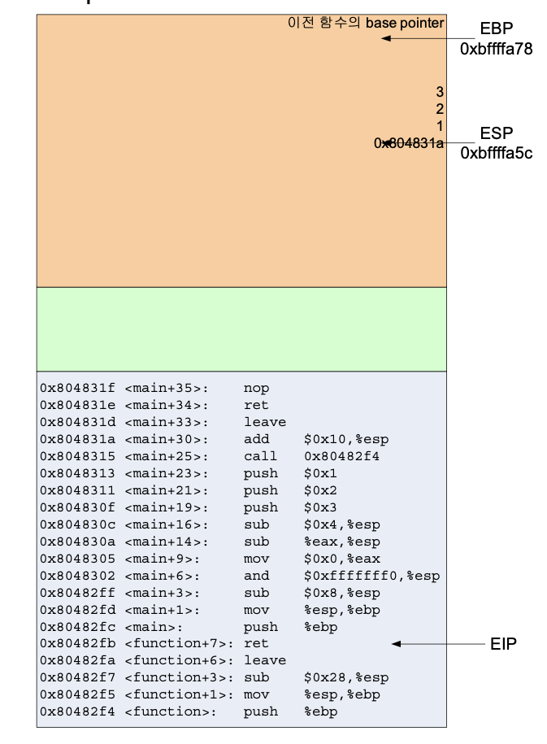

7단계
이제 leave instruction, 즉 프롤로그 작업을 되돌리는 명령을 수행했다. 함수의 프롤로그는 push %ebp / mob %esp, %ebp였다. 이것을 되돌리는 작업은 mov %ebp, %esp / pop % ebp이다.
leave instruction 하나가 위 두 명령을 한번에 한다. Stack pointer를 이전의 base pointer로 잡아 function 함수에서 확장한 스택을 없애고 push해 저장했던 이전 함수, 즉 main 함수를 복원시켰다.

pop을 해 stack pointer는 한단위 위로 올라간다. 그러면 stack pointer 는 return address가 있는 지점을 가리키고 있을것이다.
ret instruction은 이전 함수로 return하라는 의미인데 eip 레지스터에 return address를 pop하여 집어 넣는 작업을 한다 pop %eip로 표현할 수 있지만,  eip 레지스터는 직접 수정할 수 없다는 걸 기억하면 이 동작이 불가능 하다는 것을 알 수 있다.

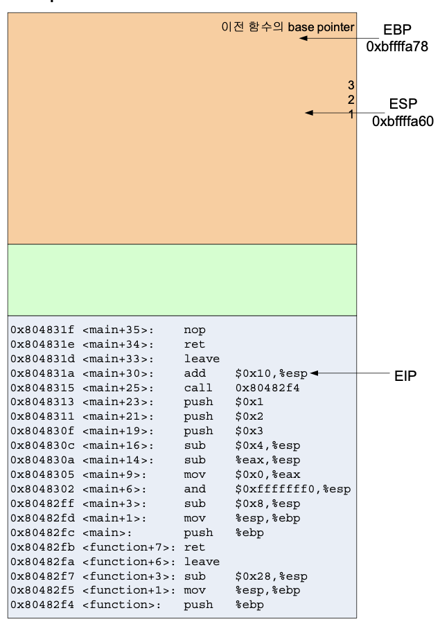

ret를 수행하고 나면 return address는 eip에 저장되고 stack pointer는 또다시 한단위 위로 올라간다.

add $0x10, %esp는 스택을 16바이트 줄인다.  따라서 stack pointer는 0x804830c에 있는 명령을 수행하기 이전 위치로 돌아간다.

leave / ret 를 수행하게 되면 각 레지스터들의 값은 main함수의 프롤로그 작업을 되돌리고 main 함수 이전으로 돌아가게 된다. 이는 init_process()함수로 되돌아가는데, 저 함수는 운영체제가 호출하는거고 개발자가 뭔진 몰라도 된다.

ref : 와우해킹 달고나 버퍼 오버플로우 기초 문서

시간이 갈수록 피로도가 더해져 이해도가 떨어지고 퀄리티가 아작이 나는것 같다. 카페인 풀도핑했는데 너무 피곤하다. 근데 30분 자다가 다시 멘토링 과제하러 가야돼. 살려주세요