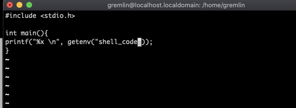

#Pwnable_Study #LOB

결국 적응 못하고 맥에다 vmware fusion을 깔아서 세팅을 했다는 감동실화다.
착한 어린이는 그냥 한번에 좀 해서 시간을 아끼도록 하자. 깔아둔 윈도우는 나중에 공인인증서 필요할때 쓰겠지 뭐. 
적어도 화요일에는 시작했어야 했는데. 세팅하느라 시간 다 날려먹고 이제야 좀 진도가 뽑히는 기분이다. 그나마 오늘도 수학 과제 크리쳐맞고 골골대다가 시작했다. 코드 분석만 하고 자야겠다.

두번째 코드다. 버퍼에는 16바이트가 들어가고, 또 strcpy를 사용해서 문제가 발생하게 될 것이다. 버퍼에 16바이트가 들어가는데, 따라서 25바이트짜리 shell code를 버퍼에 담을수가 없는 문제가 있다. 버퍼가 작을때는, 환경변수라는 것을 이용할 수 있다고 한다.
환경 변수는 프로세스가 컴퓨터에서 동작하는 방식에 영향을 미치는, 동적인 값들의 모임이라고 한다.

여튼 이번 프로그램의 메모리 구조는 버퍼(16) / SFP (4) / RET (4)가 될것이고, 이번 우리의 목표는 RET의 환경 변수의 주소를 넣는 것이다. 따라서 20바이트의 의미없는 값과, 4바이트의 주소값으로 데이터가 이루어 질 것 같다.

우선 환경변수를 설정했을 때, 환경변수의 메모리 주소를 가져올 프로그램을 만들었다. 뭐 그러하다. 

쉘코드를 환경변수로 설정해 준 모습이다.
리빙포인트) 환경변수 설정할때 연산자 사이 띄우지 마라.

만든 프로그램을 통해 환경변수가 저장된 메모리의 위치를 알았다. 이제 가보자.  메모리 적을때 두개씩 역순으로 적는거 기억하자.

혹시 몰라서 할때마다 새로 컴파일 했었는데 새로 컴파일한 파일에서  segmentation fault 나서 멘붕중이었는데 그냥 파일에 넣어보니까 작동한다, 아 ㅋㅋㅋ 10분이 또 이렇게 날아간다.
 
이 문제를 푸는 방법이 하나 더 있다고는 한다. return값에 return 이후의 주소를 집어넣고, return의 주소값이 들어가는 위치 뒤에 쉘코드를 집어넣는 것이다. 뭐 그렇다고 한다.

여튼 포인트를 좀 짚고 넘어가자. 이 문제가 지난 문제에서 달라진 점은, 버퍼에 저장할 수 있는 데이터의 양이 한정적이므로 데이터를 직접 입력하는것이 아닌 외부에 입력해야 하고, 따라서 환경변수에 쉘코드를 저장하고, return값이 가리킬 메모리를 환경 변수의 메모리 값으로 변조한다는 점이다. 뭐. 그렇다.

그리고 제발 시작할때 bash2 실행 좀 해라 이쯤되면 컴퓨터도 알아서 실행하겠다.