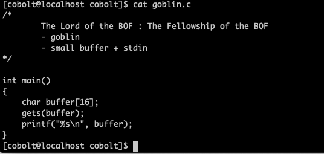
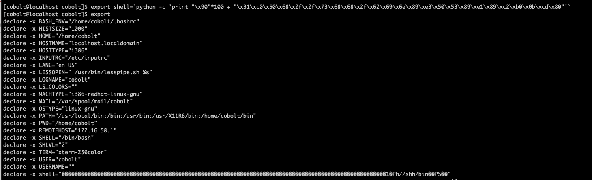
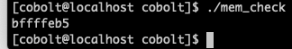
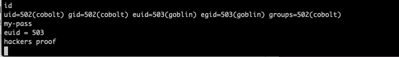
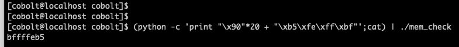

#Pwnable_Study #LOB

세번째 단계다. 어김없이 코드부터 살펴보자.

이번엔 프로그램 외부에서 입력 받는 것이 아닌, 프로그램을 실행시킨 이후 입력을 받는다. gets함수는 데이터 입력 받을 때 데이터를 검증하지 않는다.  그리고, buffer는 16바이트라 return 값 앞에서 입력할 수 있는 데이터는 20바이트로 한정되고, shell code를 return 앞에 직접 입력할 수는 없다. 환경 변수 설정이 필요할 듯 하다. 가보자.

메모리의 구조는 level 2와 거의 유사하게 buffer(16byte) / sfp(4byte) / return의 구조일 것이다. 

힌트를 받았는데, 살펴보면 리눅스의 cat 명령어를 이용해 payload 를 출력하고, cat으로 출력된 값을 goblin에 넣는 구조일 것 같다. 뭐 그렇다.

우선 환경변수 설정하고 메모리값부터 참조한 모습이다. 뭐 지난문제에도 했으니까 그러하다.

파이프라인을 통해 프로그램 내부로 페이로드를 입력하니 간단하게 해결됐다. 아마 16진수를 우리가 보는 방식이 아닌 컴퓨터가 처리하는 방식으로 처리하기 위해 파이썬이 필요할 것이다.

지난 문제와의 차이점은, 프로그램 외부의 shell 단에서 입력을 받는 것이 아닌, 프로그램 내부에서 입력을 받는다는 것이고, 이 문제를 파이프라인을 통해 입력함으로서 해결할 수 있다.

제발 이런 바보같은 짓 좀 하지말자. 뭔가했네