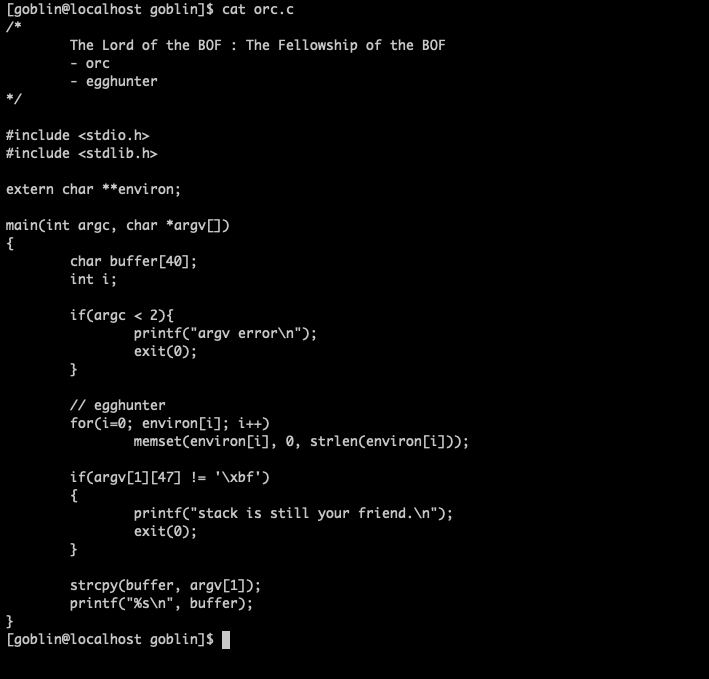
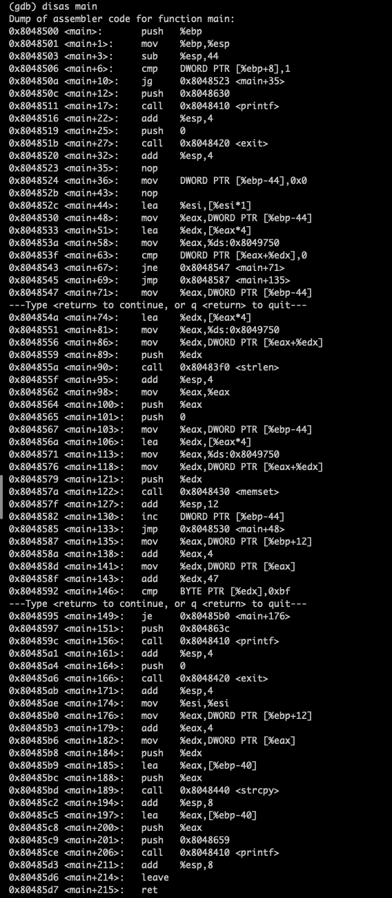
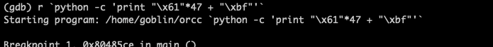
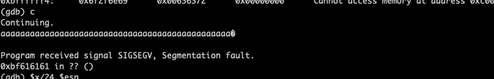
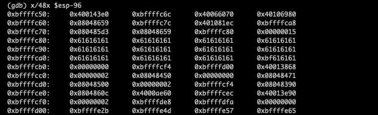
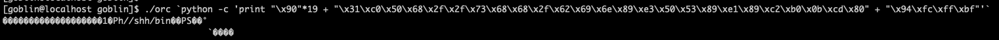
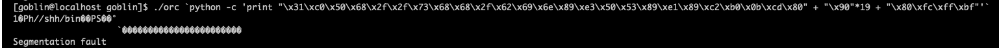
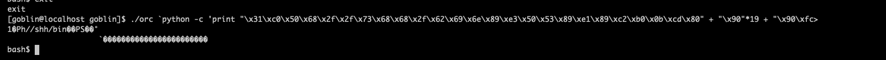

#Pwnable_Study #LOB

레벨 4까지 왔다. 코드부터 들여다 보도록 하자. 우선 또 strcpy가 사용되었다. 버퍼에 검증 안되고 데이터가 넘어갈 수 있다. 조건이 하나 있는데, 입력받은 argc의 48번째 데이터는 /xbf가 되어야 한다.  그리고 환경변수에서 입력받은 값들은 모두 무력화된다. 다른건 1번 문제와 같다. 40바이트 이상을 넣을 수 있으므로 환경변수를 생각할 필요도 없고,  segmentation fault를 일으켜 core dump를 확인하는것이 좋다.
우선 메모리 덤프를 확인하기 전에 payload를 좀 짜보면 shell code(25byte) + nop(19byte) + shell code가 시작되는 주소값을 부여하면 될 것이다. 그러하다.
주소값 빼고 먼저 짜보자.

AAA\xbf가 주소값을 가리키는 부분이다. Dump 파일을 생성해서 그걸 분석하는게 이모저모 이로운데, 뭘 해도 생성이 안되길래 그냥 포기화고 gdb로 들여다 보기로 했다.

우선 어셈블리어로 변형한 메인함수의 모습이다. strcpy가 끝나고 Printf가 실행되는 지점인 main+206에서 브레이크 포인트를 걸고, 메모리의 \x61, a를 반복적으로 47개 입력하고, 마지막 부분에 조건을 만족시켜 강제종료를 피하기 위해 \xbf를 입력해 버퍼의 시작점을 알아낼 것이다.

브레이크포인트를 걸고 브레이크포인트까지 진행시켜 메모리를 들여다본 모습이다. 이때 aaaa로 이루어진 4바이트가 0xbffffc80에서 시작됨을 알 수 있다. 이를 통해 페이로드를 작성할 수 있다

근데 여기서 계속 segmentation 오류가 난다. 나한테 왜그러는지 모르겠다. 흑흑

시작점 잘못 잡은게 맞는것같다. 이걸로 2시간동안 씨름했는데 허무한 결과다. 아

여튼 이 문제는 1번과 굉장히 유사한 구조다. 환경변수는 사용 불가능하게 막혀있고, 덤프값을 이용햐 버퍼의 시작점을 알아내어, 리턴값에 쉘 코드가 시작되는 버퍼의 주소를 입력하는 구조이다. 뭐 그러하다. 문제를 조지고 자려고 했지만, 언제나 조져지는건 나였다.