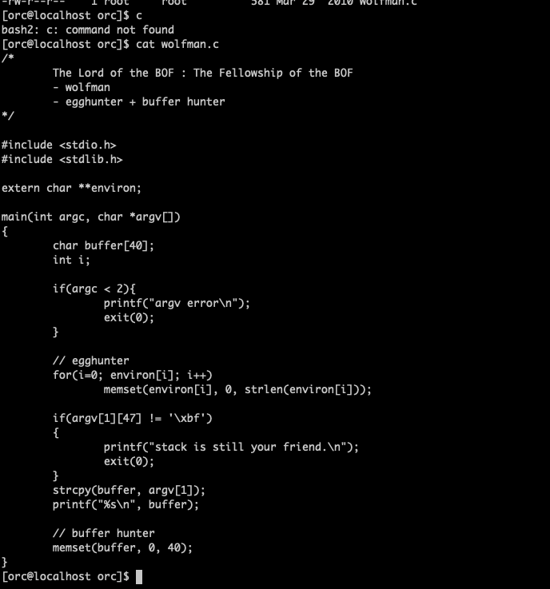
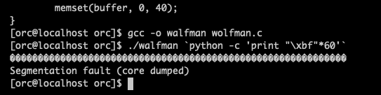
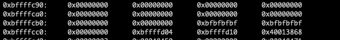
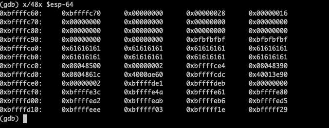
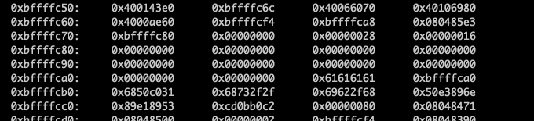
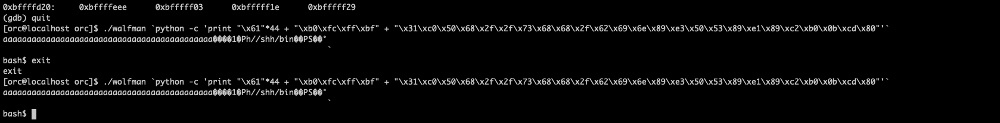
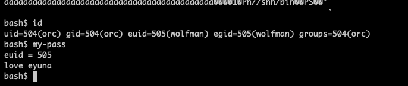

#Pwnable_Study #LOB

어쨌거나 4탄을 끝냈다. 5탄으로 가자. 코드 보러가자.

입력을 외부에서 받는데, 환경변수를 잡아내는 egghunter와 끝날때 버퍼를 비워버리는 buffer hunter가 같이 있다.  그러면 버퍼 내부나 환경변수에서 쉘코드를 주입할 수 없으니, return 값 이후에 쉘코드를 삽입해야 한다.
메모리 구조는 buffer 40 / int 4 / sfp 4 /ret가 될 것이다. return값까지 필요한 바이트수는 총 48바이트다. 새로 컴파일해서 덤프 파일을 만들어보자

정상적으로 덤프파일이 만들어졌다. gdb로 들여다보자

비워진 부분 40바이트를 확인했다. 이제 return이 가리키는 주소 뒤에 데이터를 삽입해보자.

데이터가 return 값 바로 뒤인 0xbffffca0부터 저장되는 모습이다. 이를 통해 페이로드를 작성하면, nop 44바이트 / return이 가리킬 bffffca0 / shell code가 될 것이다. 가자.

segmentation error가 또다시 발생해서 보니까 또 메모리 주소 잘못 입력했다. 대가리가 몇번 깨져보니까 해결이 빨라진다
여튼 잘 됐다. 끝났다. 이제 잘 수 있다. 신난다.흑흑흑흑
