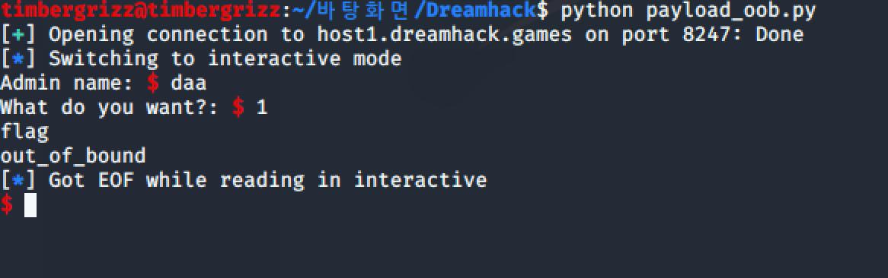

포너블 스터디도 시작해보자. 첫 문제는 웰컴인데, 이건 뭐 접속만 하면 될거다.

예상과 다르지않다. 이제 우리가 풀어야 할 OOB 문제로 가자.

우선 pwntool의 함수들을 조금 알아보고 이를 통해 welcome 문제를 다시 풀어보자. from pwn import * 로 pwntool 모듈을 가지고 와야 한다.

원격으로 접속은 remote 함수로 하는데, 이때 변수를 지정해주어야 한다.  netcat으로 접속 되며 접속 정보가 여기 담기는 것 같고 php에서 sql 연결하는것과 비슷해 보인다. 로컬에 있는 프로그램에 작업할 땐 process 함수로 이루어진다.

Pwntool의 기본이 receive, interactive라고 한다. interactive는 프로그램을 실행하고 입력을 따로 할 때, 입력을 가능하게 해준다고 한다. 모든 공격이 interactive로 가능해진다. 정확히는 쉘과 직접적으로 명령을 송수신 할 수 있는 함수라고 한다.

우선 아까 그냥 접속만 해서 풀었던 welcome 문제를 python의 pwntool을 이용해 다시 풀어보자.

리빙포인트) pwntools의 모듈 이름은 pwn이다. 이 멍청한 놈아.

짜여진 페이로드는 굉장히 간단하다.

간단하게 문제가 해결된 모습이다. 이 예시에사, interactive 함수가 뭘 하는지 알 수 있다.

다음 문제는 OOB인데, 예전에 썼던 필기 내용 좀 보고오자.

Out-Of-Boundary(OOB)
OOB 취약점은 버퍼의 길이 범위를 벗어나는 곳에 데이터에 접근할 수 있는 취약점이다

대충 배열 쓰는데, 배열 외부의 인덱스에 접근할 수 있을 때 발생하는 취약점이다.

문제 파일은 미리 리눅스에 받아 놨다. 소스 코드를 살펴보자.

뱐수를 살펴보면, 전역 변수로 name과 command가 선언되어 있다. 뭐 그러하다. command 변수에는 리눅스의 명령어들이 담겨 있고, main함수를 보면 인덱스를 입력받아, system 함수를 통해 OS에 명령어를 입력하는 것을 확인할 수 있다.

다른 함수 두개는 나중에 알아보도록 하자. 지금은 중요하지 않다.

그리고 main함수에서 변수 name의 크기만큼 read함수를 통해 입력을 받는다. 

우선 작동을 알아보기 위해 welcome에서 작성한 페이로드를 이용해 접속만 해보았다. index 1번을 실행하니,  예상대로 command의 두번째 항 ls가 실행되는 모습이다. 우리가 다운로드 받아 로컬에 있는 프로그램도 동일하게 작동할 것이다.

이 문제의 목적은, 같은 디렉토리에 있는 flag라는 문서를 읽는 것이다. 이를 위해서는 첫번째 인자를 이용해, 프로그램 내부에서 command 배열을 조작해 cat flag를 명령어로 만들거나, 쉘을 가져와 실행하는 방법이 있을 것이다. 

이제 gdb로 스택의 구조를 직접 살펴보며 페이로드를 짜보자.

우선 로컬에서 실험을 하고 이를 적용할 것이므로, 로컬에 존재하는 프로그램을 실행하는 코드로 변경했다. 이제 페이로드를 짜 보아야 한다.

우리의 목표는 변수 command[idx] 가 cat flag나, /bin/sh를 가리키도록 하는 것이다. 그리고 우리가 문자로 입력할 수 있는 부분은 name밖에 없었다. 이를 위해서는 name에 우리가 입력할 명령어 값을 입력하고, 이를 command[idx] 값이 가리키도록 해야 한다.

리빙포인트) 커맨드 변수다.

우선 gdb로 가보자. 메인 함수가 작동하는 것을 살펴보았다. read 함수 부분을 살펴보면, 중간에 name이라는 인자가 들어가 있고, 이 인자들을 살펴보아 name의 위치를 알 수 있다.

Name 함수의 인자들이 담겨있는 모습이다. 밑에서부터 0, name, sizeof(name)이다. 이를 통해 변수 name의 주소를 알 수 있다.

동일한 방법으로 command의 주소를 살펴보자. System 함수를 호출하는 부분 윗부분을 살펴보면, eax를 push하는 것을 알 수 있다. eax가 어떤 값인지 살펴보자.

이 부분을 살펴보면, mov 명령어로 eax 값에 넣고 있는 것을 볼 수 있다. DWORD는 4바이트고, PTR은 포인터로 생각한다.  eax의 값을 4배한 값에 주소를 더한 값을 다시 eax에 넣는 것 같다.

이 이전의 eax의 값은 ebp에서 16, 0x10을 뺀 값이다.  ebp - 0x10은 scanf의 인자로 들어가고 있는데, 이 값을 eax에 넣어주는건데, 이를 통해 idx의 후보값을 알 수 있다. scanf의 인자로 들어가고 있는데, 여튼 두개의 push 중 하나가 idx값임을 알 수 있다. 저 메모리값이 뭔지를 알면, idx가 ebp-0x10임을 알 수 있다. 그럼 메모리가 뭔지를 알아보자.

그 메모리 주소에 찾아가봤더니, %d가 나오는 모습이다. 그럼 우리가 생각했던대로 ebp-0x10이 idx값을 가리키고 있는 것을 알 수 있다. 이를 통해 eax 값들의 정체도 알 수 있다.

그럼, 우리가 입력한 idx값에 4를 곱한 값에,  command에서 가져온 idx값이 될 것이다. eax가 0일 경우를 생각하여, command의 시작 지점을 알 수 있고, 이는 0x804a060이다.

그럼 idx * 4 + 0x804a060 값이 name의 주소를 가리키게 하면 되는데, 우리가 아까 구했던 name의 주소값은 0x804a0ac 였다. 따라서, idx를 통해 이 값을 가리키게 하면 된다.

name값과 command의 주솟값의 차를 구한 값이다. 참고로 gdb-peda에 계산기도 내장되어 있다. 이를 활용하면 좋다. 이 값을 4로 나눈 값을 idx에 넣고, 10진수로 변환해 idx에 넣을 값을 알 수 있다.

10진수로 변환한 값이다. 4로 나누면 19고,  따라서 command[19]는 name의 시작 주소, 즉 name[0]이 될 것이다. 참고로 name도 문장이라 배열이다.

여기서 다시 등장하는게, command가 포인터라는 사실이다. 메모리값을 살펴보면 문자열이 아닌것을 알 수 있는데, 안에 들어있는 주소를 살펴보아야 한다.

들어가있던 주소를 살펴 보면, 문자로 들어가있던 명령어들이 있는 모습이다. 따라서, command에 저장되어 있는 주소를 살펴보면, 이 주소에 문자열이 담겨있는 것이다.

이제 우리가 할것은, command[19]에 우리가 원하는 명령어가 담긴 주소를 삽입해야 한다. 이를 위해서는 command[19], 즉 name[0] 값이 명령어가 담긴 주소값을 가리키면 되는건데, name도 char이므로 한 문자에 1바이트고, 따라서 0번부터 3번까지의 인덱스가 필요하다. 그리고 이 이후에 cat flag가 입력되도록 하면 된다. 그렇게 되면, name[4]부터 우리가 입력하려는 명령어가 입력되게 되므로, command[19]가 가리키는, name[0] ~ name[3]에 들어있는 주솟 값은 name[4]가 될 것이다. 이렇게 하면, 결과적으로 commend[19]가 name[4] 에 있는 명령어를 가져오게 될 것이다.

이제 페이로드를 짜보자. 우선 name에 처음 들어갈 값은 name[4]의 주소인데, name[4]의 주소는 우리가 알고 있는 name[0]의 주소에 4바이트를 더한 값일 것이다. 

name+4의 값은 0x804a0b0 이다. 이를 이용해 페이로드를 작성해보자.

우선 사용한 변수들을 살펴보면, name4_add에는 name[4]의 주소, execute에는 실행할 명령어, payload에는 name에 입력할 값인데, 이때 리틀 엔디언 방식으로 입력을 해야 하므로, p32라는 함수를 통해 리틀 앤디언 방식으로 변환한 모습이다. 

리빙포인트) 접속 정보가 담긴 p의 멤버함수들은 함수 앞에 p. 적어주셔야 한다.

사용한 함수들을 살펴보면, recvuntil 함수는 특정 문자열이 나올 때 까지 프로그램에서 입력을 받는 함수이다. 이를 통해 코드 내부에서 Admin name: 까지 입력을 받고, name에 payload를  입력하는 모습이다.

name값에만 입력하는 페이로드는 이렇게 생겼다. 그러하다.

이렇게 하면 Admin name의 입력값이 안뜨는 모습이다. 변수로 받을수도 있는데, 필요할까?

이제 두번째 인덱스도 입력해보자. Name에 입력할때와 똑같은 방식으로 입력하면 된다. 테스트를 위해 로컬에도 flag라는 파일을 하나 만들어 두자.

리빙포인트) idx도 int가 아닌 문자형으로 줘야 한다. Cui 환경에서 에러를 마주하면 굉장히 골때리니 주의하도록 하자.

하여튼 로컬에서는 잘 작동하는 모습이다. 이제 이걸 드림핵으로 가져가서 작동시키면, flag를 얻을 수 있을 것이다.

드림핵 서버에 접속하도록 코드를 수정해줬다. 이제 작동만 하면 된다. 제발

작성한 페이로드가 정상적으로 작동하는 모습이다.
 

정리하자. OOB 공격은 배열에서 주어진 배열을 이탈한 메모리의 값을 참조하도록 하여 버그를 만든다. 우리는 name 변수에 우리가 원하는 명령어를 삽입했고, commend 배열의 인덱스를 조작하여 name 변수를 참조하게 했고, 이를 통해 명령어가 있는 메모리 값을 참조하도록 하였다.

하나하나 따라하는건 언제나 크게 어렵지 않지만, 이해하는 것과 이를 적용하는 것은 어렵고, 나의 몫이다. 이를 이해했으면 조금 더 열심히 하자.