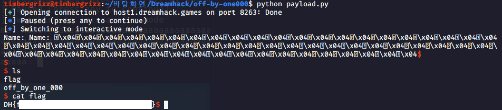

#Pwnable_Study #DreamHack

이번에는 off-by-one 문제들을 풀어 볼 것이다. 우선 off-by-one 공격들을 좀 복습해보자. Off-by-one은 경계 검사에서 하나 더 많은 값을 쓸 수 있을 때 발생하는 취약점이다. 32바이트 크기 버퍼에 인덱스 32로 접근하는 것 같은 경우이다. 반복문을 순회할 때 잘못된 비교 연산자를 사용하거나 인덱스가 0부터 시작하는 것을 고려하지 않았을때 발생한다.

우선 코드를 살펴보자. get_shell()이라는 함수를 이용해 shell을 실행할 수 있다. 하지만 main 함수에서는 get_shell()에 접근하지 않고 있고, 따라서 이 함수에 접근하도록 해야한다.

유저가 입력할 수 있는 칸은 cp_name이라는 256바이트 크기의 배열이. [255]까지만 사용이 가능한데, strcpy함수를 사용하고 이 함수는 배열의 크기를 확인하지 않아 문제가 발생한다. 따라서 256번째 인덱스에 접근해 문제를 일으킬 수도 있다. 그러나 read 함수에서 이러한 문제는 해결된다. cp_name의 size만큼만 입력을 받고 있기 떄문이다.

그러나 이 배열의 사이즈만큼만 입력을 받아도 문제가 발생하게 된다. 사용자가 문자열을 입력하고 복제할 떄 strcpy 함수에서 끝자리에 \x00, 즉 null 값이 자동으로 붙게 되고, 따라서 256바이트의 글을 입력하게 되면, null 문자가 배열 밖에 입력되며, 따라서 EBP 영역을 침범하여 문제가 발생하게 된다.

우선 기본적인 페이로드를 작성하고, 이를 실행한 후 gdb와 실행중인 프로세스를 연결했다. Gdb-peda에 내장된 attach 명령어를 이용한다.

커널에서 함수들을 빠져나와 main함수로 접근한 모습이다. 우리는 ebp와 esp의 동작을 중점적으로 보아야 한다. 메인에서 입력받을때는 정상적으로 동작하지만, copy함수를 진행하면서 비정상작으로 동작하게 된다. copy함수를 진행시켜 변화를 살펴보자.

ebp의 주소 변화를 살펴보면, 마지막 1바이트가 00, null 값으로 바뀐 모습이다. 256바이트를 카피하면서 null까지 카피가 되면서 SFP의 1바이트를 변조하게 된 것이다.

코드에서 설명했듯이 strcpy가 문자열을 복사하는 과정에서 끝자리에 null을 첨가하고, 따라서 257바이트가 복사되게 된다. 1바이트가 넘치게 되면 바로 뒤에 있는 sfp 영역을 침범했고, 따라서 원래 main의 ebp를 가리키고 있던 sfp값이 잘못된 값을 가리키게 된다. 이렇게 되면서 main으로 다시 돌아갈 떄 문제가 발생하게 된다.

Cpy 함수를 종료한 후 Main 함수의 ebp를 확인해도 잘못된 메모리 주소가 전달되는 모습이다.

다음번엔 leave라는 명령어가 실행되는데, 이는 esp의 값에 ebp 값을 넣고, ebp값을 제거하는데, 원래 주솟값이 4씩 증가를 해야하지만, leave 이후에 잘못된 값이 전달되는 모습이다,

print에서 출력하는 인자들 중 잘못된 인자가 들어가며 return값이 잘못 변조되며 문제가 발생하게 된다.

Cpy함수가 종료되면서 ebp값이 변조되었고, ebp값을 기준으로 스택을 쌓다가 잘못된 데이터를 참조하게 되며 문제가 발생하게 되었다.

공격 코드를 생각해보자. 우선 256바이트를 채워야한다.  그리고 이 256바이트 공간 안에 get_shell의 주소를 가리키도록 해야한다 그러면 get_shell의 주소가 포함된 257바이트가 real_name이 들어가고, cpy함수가 끝나면서 ebp가 조작되고, 조작된 ebp로 인해 main에서 잘못된 주솟값이 참조되어 return 될 것이다. 

get_shell의 주소를 알아낼 수 있다. 맨 위에 있는 주소로 return이 되고 차례대로 싫애이 될 것이다.

페이로드를 작성했다. get_shell의 주솟값을 256바이트만큼 넣은 모습이다.

정상적으로 쉘이 탈취된 모습이다. 이 페이로드를 이용해 이제 문제를 풀어보도록 하자

드림핵 서버에 접속해 페이로드를 싫행핵고, 정상적으로 쉘이 탈취되어 flag를 확인할 수 있었다. 프로그램이 실행될 때 마다 주솟값이 조금씩 달라질 수 있고, 따라서 이때 실행이 안될 수 있다. 계속 실행을 해보십시오 휴먼. 

어쨌거나 1번 문제를 풀었다.

정확히 원리를 설명하면, cpy함수에서 buf(real_name) + sup + ret 의 구조에서 sfp가 변조되어 null값이 되게 되면, buf 내부를 가리킬 수 있게 된다. 이때 buf 내부를 가리키게 된다면, leave 명령어를 통해 esp도 buf의 어떤 공간을 가리키게 되고, 따라서 ret도 esp가 가리키는 buf 의 내부 값을 가리키게 될 것이다.

이제 두번째 문제로 넘어가보자.

언제나 그렇듯이 코오드부터 살펴보도록 하자. 이번에도 get)shell 함수를 실행시키는 것이 목적인데, int age값을 변조하여 값을 바꿀 수 있다면, get_shell 함수를 실행시킬 수 있을 것이다. 다른건 뭐 크게 살펴볼 문제가 없다.

name이라는 배열은 0~19까지의 인덱스를 사용하고, 이때 20바이트를 모두 채워넣으면 read_str의 len이라는 변수는 ptr[20]에 값을 삽입하게 된다.이렇게 되면 name[20]에 0이라는 값이 들어가게 된다. 이제 코드를 어셈블리어로 분리해보자.

1이라는 값을 ebp-0x4에 저장하는 것을 볼 수 있다. 따라서 ebp-0x4가 우리가 변조해야할 부분인 age 변수라는 것을 알 수 있다. 다음은 read값의 인자를 찾아보자.

Read 함수의 인자와 전달된 값을 통해 name 의 주소를 찾은 모습이다. 이러한 주소를 토대로 buffer를 구성하면 Name의 시작 위치와 age의 위치의 차이가 20이므로

Name[20] + age(4) +sfp + ret가 될 것이다. 따라서 name애 20바이트를 삽입하면 함수 get_shell이 실행될 것이다.

20바이트를 삽입하는 코드이다.

로컬에서는 정상적으로 코드가 실행되는 모습이다. 이제 서버에 접속해서 해보자.

정상적으로 플래그가 취득된 모습이다.

정리하자. 배열은 0부터 시작해서 배열의 마지막 인덱스 값은 size-1이다. 이때 배열의 size의 인덱스에 값을 입력하게 되면, 스택이 변조되게 되고, 스택이 변조되면 sfp에 문제가 발생하여 잘못된 메모리 주소가 esp로 전달되어 의도하지 않은 메모리 주소가 실행되거나 다른 변수를 변조할 수 있게 된다. 그러하다.