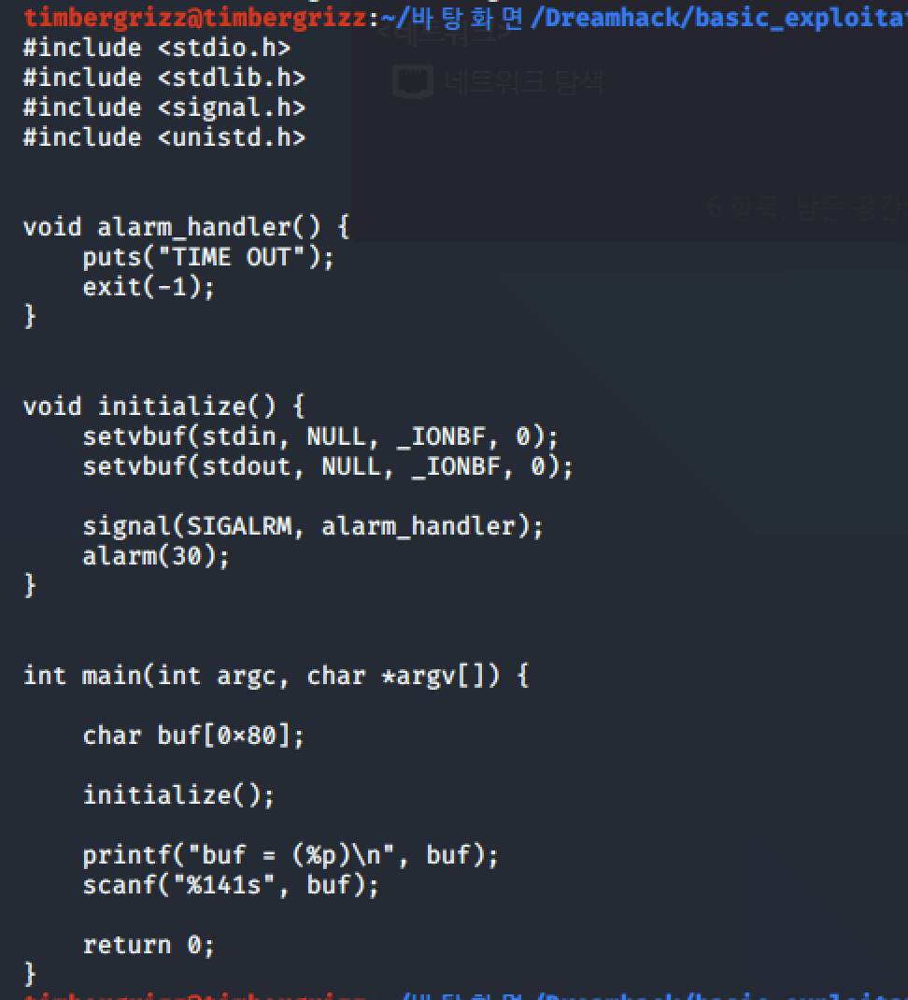
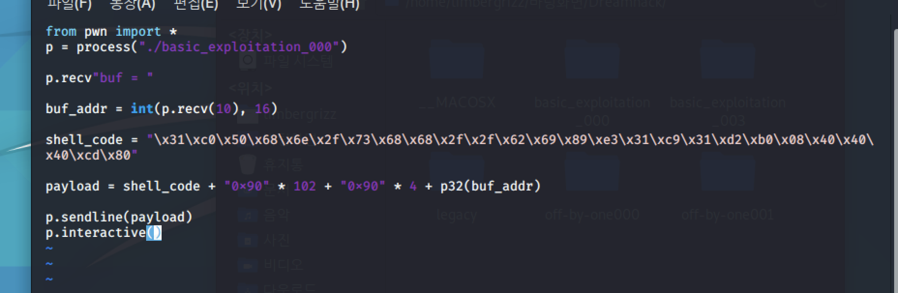
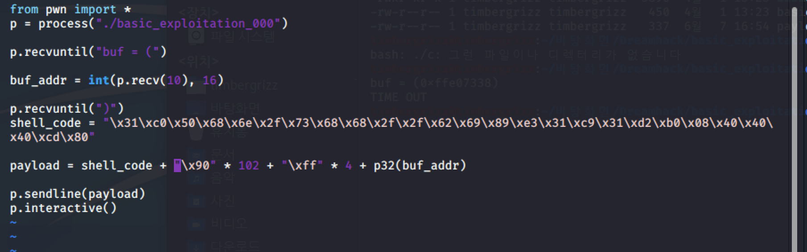
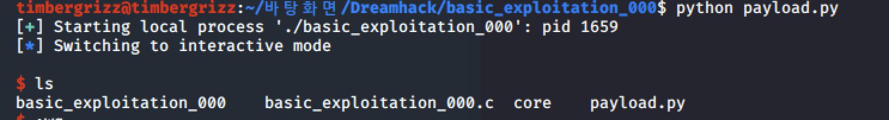
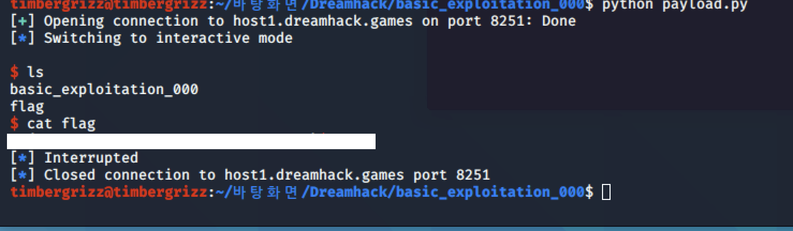

#Pwnable_Study #DreamHack

다음 문제인 000번으로 가보도록 하자. 항상 그렇듯이 코드부터 확인하시면 된다.

우선 시스템에 접근하는 명령어가 없다. 그러면 우리는 페이로드에 쉘 코드를 집어넣어야 한다는 뜻이다. 프로그램은 버퍼의 주소를 출력하고, 141바이트만큼 입려을 하게 된다. 버퍼는 128바이트이다.

입력할 페이로드의 구조를 생각해보면, 우선 쉘코드를 25바이트 입력하고,  dummy값을 return 값 이전까지 입력해야하며, return에 쉘코드가 저장된 메모리 주소를 입력하면 된다.

사용하는 쉘코드는 26바이트인 하단에 기재된 코드를 사용했다. 25바이트를 사용하는 쉘코드는 사용할 수 없다고 한다. 자세한 이유는 모르겠읍니다. 혹시 확인하신다면 정확한 이유를 알려주시면 감사하겠읍니다.

\x31\xc0\x50\x68\x6e\x2f\x73\x68\x68\x2f\x2f\x62\x69\x89\xe3\x31\xc9\x31\xd2\xb0\x08\x40\x40\x40\xcd\x80

프로그램을 실행하면 버퍼의 주소가 출력되는데, 짤 때, 프로그램이 출력하는 버퍼값을 입력받고, 입력받은 버퍼의 주소를 통해 입력하는 코드에 버퍼의 주소를 삽입해야 한다.

이를 통해 페이로드를 작성한 모습이다. 우선 변수가 하나밖에 없고, 입력받는 배열의 크기는 128바이트이므로 쉘코드와 nop로 128바이트를 채우고, sfp 4바이트도 nop로 채운 후, ret가 가리키는 값에 쉘코드가 있는 스택의 시작 주소를 집어넣는다.

처음에 작성한 프로그램에 몇가지 오류가 있었고, 이를 수정한 모습이다. 뭐가 됐든 프로그램을 작성하실 때 몇가지 중요한 사항들이 계신다. 우선, 문자열 안에 16진수로 입력하고싶으면 0x가 아니라 \x로 작성해야하고, 함수 쓸때 사용하려는 정확한 함수로 입력을 해야한다, 또, 프로그램이 실행되었을 때 출력값을 잘 확인하셔야 한다. 나보다 경험 많으신 분들도 헷갈릴 수 있으니까 아직은 괜찮으시다.

여튼 정상적으로 쉘이 실행되는 모습이다. 이제 원격으로 접속해서 쉘을 실행시켜 보자.

이번 문제도 풀었다. 정리하러 가자.

이 문제는 버퍼 오버플로우 문제다. 버퍼의 크기보다 더 큰 입력값을 받게되어 ret 값에 접근할 수 있다. 따라서 쉘코드를 삽입하고 쉘코드의 주소를 return하게 된다면 쉘의 권한을 탈취할 수 있게 된다. 그러하다.