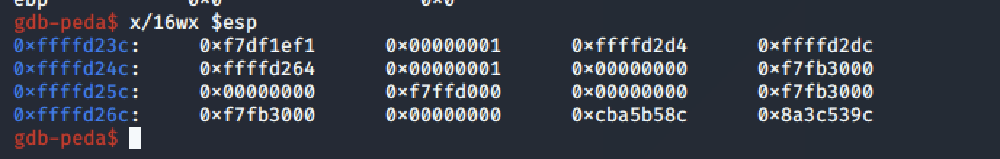
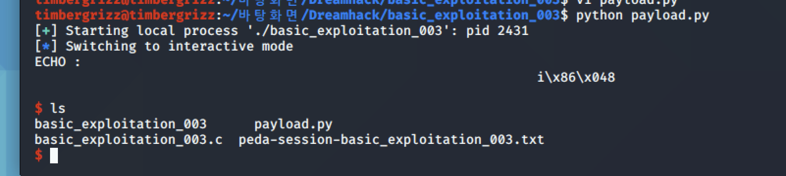

#Pwnable_Study #DreamHack

이번주도 즐거운 포너블 스터디 시간이다. 이번주부터는 제목에 취약점에 관련된 정보가 없다. 코오드만 보시고 어떤 취약점이 존재하는지 알아보아야 한다. 그래도 시작해보자. basic_exploitation_003부터 시작한다.

코드를 살펴보자. 우선 우리의 목표는 잘못된 입력을 get_shell 함수를 실행시키는 것이다. 나머지 함수는 항상 존재하는 시간차이나 초기화 함수고, main함수를 살펴보도록 하자.

변수부터 살펴보면, heap_buf에서 heap 영역에 128바이트,  stack_buf에서 stack 영역에 144바이트 할당되어 있다. Read 함수로 heap 버퍼에 입력을 받고, sprintf에서 stack_buf 변수에 heap_buf에 저장된 값을 넘겨주게 된다. 이떄, sprintf는 FSB 취약점으로 이어질 수 있다. 문제는 형식이 넘어가지 않아 발생한다. Format String Bug를 좀 더 살펴보고 가야 하지 않을까? 예전에 썼던 라이트업들 좀 보고가자.

FSB는 printf나 sprintf와 같은 함수에서 포맷 스트림 문자열을 올바르게 사용하지 못해 발생한다. 매우 강력한 취약점이지만, 최신 컴파일러에서는 여러가지 방법으로 이를 방어하고 있어 최근엔 잘 발생하지 않는다.

우리는 포맷 스트링을 직접 입력할 수 있고, 이러한 취약점을 통해 함수를 실행시킬 수 있을 것이라는 생각을 가지고 시작해보자.

우리의 목표는, return이 되는 주소까지의 거리를 알아내어 입력에서 그 거리만큼 띄워 return에 접근하도록 하고, 이를 통해 return이 가리키는 주소에 get_shell 함수의 주솟값을 입력하는 것이다. 이때, %x를 이용해 띄울 수 있다

우선 get_shell의 return 주소부터 확인하자. 그 다음에는 버퍼의 주소부터 - sfp의 주소까지의 거리를 알아내면 된다. 프로그램을 실행하고, 임의의 값을 입력해보지.

우선 sprintf가 실행되고 스택에 입력한 값이 들어간 것을 확인했으니, 메모리로 들어가보도록 하자. 

이를 통해 버퍼의 시작 주소를 알아낼 수 있다.  이제 sfp의 주소를 구조로 통해 알아보자

메모리는 buf[128] + ___ + sfp[4] + ret[4] 의 구조로 이루어져 있을 것이고, 우리가 모르는 ___ 값을 알아내야 한다.

우선 leave의 실행 전-후의 esp가 가리키는 주소를 확인하자. leave가 실행되고 return이 실행될 것이므로 esp가 sfp를 가리켜야 할 것이다.

다시 esp를 확인하면, sfp의 값을 알 수 있을 것이다.

이제 우리는 sfp의 주소와 입력한 주소가 저장되는 메모라값의 주소를 모두 알 수 있다. 따라서 이 거리를 계산하면, sfp까지의 거리를 알아낼 수 있다.  거리는 0x9c, 156이고, 이를 통해 메모리에 주솟값을 삽입할 수 있게 된다.

이제 페이로드를 작성하러 가보자. 우선 %156c를 이용해 sfp값까지 이동시켰고(이때 %c를 이용해야 1바이트씩 이동시킬 수 있다. %x는 int형이므로 한번에 4바이트씩 움직인다). 그리고 get_shell 함수의 주솟값을 삽입한다. 이렇게 작성을 한 후 로컬에서 테스트를 해보자.

로컬에서는 정상적으로 실행이 되는 모습이다. 이제 드림핵 서버에 접속해 입력해보도록 하자.

정상적으로 키를 따온 모습이다. 드림핵 서버에 접속이 안되어서 리부팅 하니까 되는걸 보니, 가상 머신 인터넷이 끊겼던 것 같다. 하여튼 구했다.

정리하자. 이 문제는 sprintf함수를 사용할 때 형식 등에 대한 검증이 없어, 사용자가 직접 포맷 스트링을 입력할 수 있게 된다. 이를 통해 sfp값에 접근하고, 우리가 실행하고자 하는 함수의 주솟값을 입력해 우리가 실행하고자 하는 함수인 get_shell을 실행할 수 있게 된다. 이러한 취약점은 포맷 스트링을 사용자가 입력할 수 있도록 설계되었을 때 발생한다.